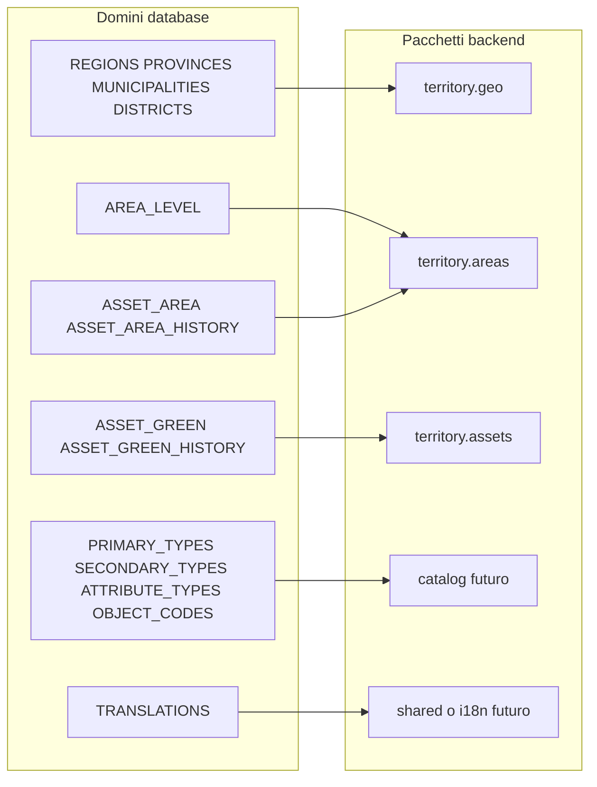
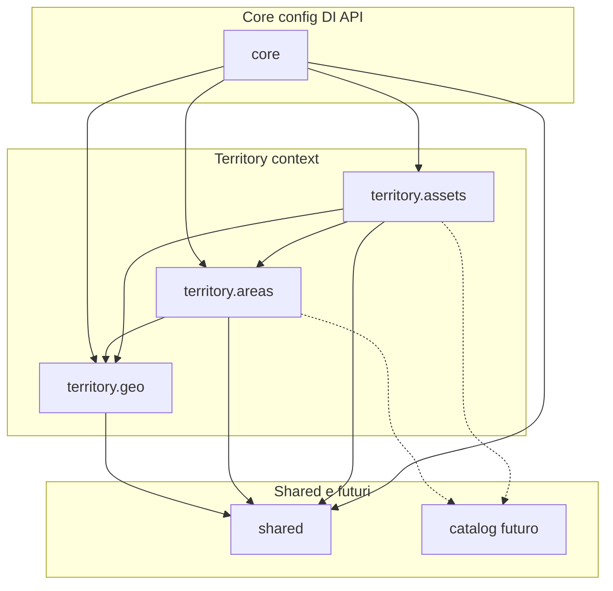
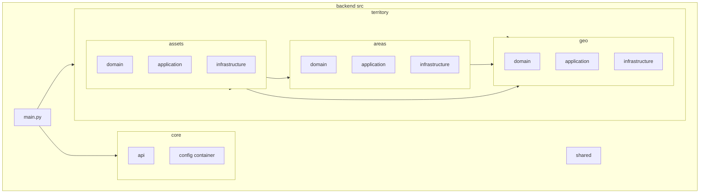
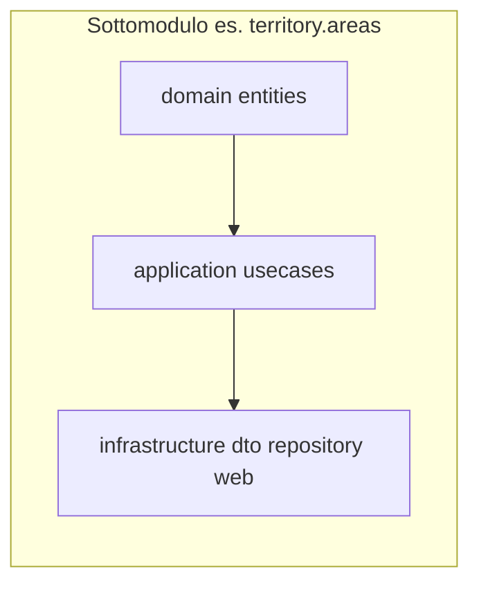

# Struttura modulare dei pacchetti – Backend e database

Questo documento deriva dall’analisi del [database mapping](../../docs/database/design/database-mapping-diagram.md) e propone la **mappatura tra entità DB e pacchetti backend**, con diagrammi Mermaid per dipendenze e struttura.

**Quando usarlo:** onboarding, scelta del modulo in cui aggiungere una feature, introduzione di un nuovo pacchetto (es. catalog), verifica delle dipendenze tra moduli.

---

## Livello di maturità della struttura

| Aspetto | Situazione attuale | Cosa la porterebbe a livello senior |
|--------|---------------------|-------------------------------------|
| **Confini e naming** | Domini chiari (geo / areas / assets), naming alineato al DB | Esplicitare i **contract** tra moduli (es. “areas espone solo X, non il repository”) e dove finisce un bounded context |
| **Dipendenze** | Regole scritte, grafo senza cicli, shared usato da tutti | Rendere le regole **verificabili** (lint/arch-unit, import path) e documentare le eccezioni con motivazione |
| **Allineamento al dominio** | Mappatura DB → pacchetti esplicita, coerenza con il modello dati | Aggiungere **criteri di evoluzione**: quando estrarre catalog, quando un sottomodulo va splittato (es. troppe responsabilità) |
| **Architettura per modulo** | Clean Architecture (domain → application → infrastructure) per ogni sottomodulo | Chiarire **cosa non deve mai uscire** (es. entità DB o DTO non oltre l’infrastructure del modulo che li possiede) e strategia **test** (unit sui use case, integration sui repository) |
| **Trade-off e alternative** | Scelte implicite (catalog “futuro”, AREA_LEVEL in areas o catalog) | Breve **rationale**: perché catalog separato e non sotto territory; perché shared vs modulo i18n dedicato; cosa si è scartato (es. monolite flat) |

Sarebbe utile adottare **ADR (Architecture Decision Records)**: documenti brevi (uno per decisione) che registrano il contesto, la decisione presa e le conseguenze. Servono a non perdere il perché di una scelta quando il team cambia, a far discutere le alternative in modo esplicito e a dare a chi arriva dopo (o a chi ha dimenticato) il rationale delle architetture e dei moduli—ad esempio perché esiste un modulo `catalog` separato o perché le traduzioni stanno in `shared` invece che in un modulo `i18n` dedicato.

---

## 1. Mappatura Database → Pacchetti

Le entità del modello dati si raggruppano in domini logici; ogni dominio corrisponde a un modulo (o sottomodulo) del backend.

| Dominio DB | Entità / tabelle | Pacchetto backend | Note |
|------------|------------------|-------------------|------|
| **Gerarchia amministrativa** | REGIONS, PROVINCES, MUNICIPALITIES, DISTRICTS | **territory.geo** | Confini amministrativi; usati da areas e assets per partitioning e RLS. |
| **Livelli area (riferimento)** | AREA_LEVEL | **territory.areas** (o modulo **catalog** futuro) | Definisce MANAGEMENT_UNIT, FUNCTIONAL_SUBAREA, ecc.; referenziato da ASSET_AREA.level_id. |
| **Catalogo DBT** | PRIMARY_TYPES, SECONDARY_TYPES, ATTRIBUTE_TYPES, OBJECT_CODES | **catalog** (futuro) o **territory.catalog** | Tipi e codici DBT; referenziati da ASSET_AREA e ASSET_GREEN (object_code_id). |
| **Aree verdi** | ASSET_AREA, ASSET_AREA_HISTORY | **territory.areas** | Aree/parchi; dipendono da geo, AREA_LEVEL, OBJECT_CODES. |
| **Asset verdi** | ASSET_GREEN, ASSET_GREEN_HISTORY | **territory.assets** | Alberi/elementi puntuali; dipendono da geo, areas (area_id), OBJECT_CODES. |
| **Traduzioni** | TRANSLATIONS | **shared** o modulo **i18n** (futuro) | Etichette per tabelle/enum; cross-cutting. |

---

## 2. Diagramma: Domini DB → Pacchetti

*Le frecce indicano: questo gruppo di entità DB è gestito da questo pacchetto.*

---

## 3. Diagramma: Dipendenze tra pacchetti

Il grafo mostra chi può dipendere da chi (freccia = “A usa B”). **core** orchestra e monta i moduli; **territory.geo** è la base per areas e assets. Linea tratteggiata = dipendenza prevista (modulo catalog non ancora presente).

- **Implementato oggi:** core, territory.geo, territory.areas, territory.assets, shared (vuoto).
- **Futuro:** modulo **catalog** (DBT + eventualmente AREA_LEVEL) usato da areas e assets; **shared** o **i18n** per TRANSLATIONS.

---

## 4. Struttura ad albero dei pacchetti (src layout)

*`main.py` è il composition root: monta core e moduli territory; le frecce indicano “dipende da”.*

---

## 5. Livelli Clean Architecture “soft” per sottomodulo

Ogni sottomodulo sotto **territory** (geo, areas, assets) segue una struttura a tre livelli in versione **soft**: nessun layer di port/interfacce; i use case dipendono dal domain e dai repository concreti (infrastructure). Il container in core monta repository e use case e li espone alle route.

| Livello | Contenuto tipico | Dipendenze |
|---------|-------------------|-------------|
| **domain** | Entità, value object (modelli di dominio; possono usare core.database per Base ORM) | core.database (Base) se si usano modelli SQLAlchemy in domain. |
| **application** | Use case (query/command); ricevono il repository concreto in costruzione | domain, infrastructure (repository concreti). |
| **infrastructure** | DTO, repository (PostGIS), web (controller FastAPI), mapper | application (use case), core.api (dependencies), eventualmente territory.geo (mapper, tipi GeoJSON). |

---

## 6. Regole di dipendenza (da rispettare)

| Da → A | Consentito | Non consentito |
|--------|------------|----------------|
| **territory.*** | core (config, API), shared, altri sottomoduli territory (es. areas → geo) | Dipendenze circolari tra geo/areas/assets |
| **core** | shared, tutti i moduli territory (per montare router e use case) | — |
| **shared** | Nessuna dipendenza verso domain/application di altri moduli | Import da territory o core (resta solo tipi/utility generici) |

---

## 7. Riepilogo e passi successivi

- **Allineamento DB → pacchetti:**  
  **territory.geo** = gerarchia amministrativa; **territory.areas** = aree verdi + history; **territory.assets** = asset verdi + history. AREA_LEVEL e catalogo DBT sono oggi solo sul DB; quando serviranno API dedicate si può introdurre il modulo **catalog** e, se utile, spostare le traduzioni in **shared** o **i18n**.

- **Struttura modulare corretta:**  
  Coerente con il DB è la suddivisione in **core**, **territory** (geo, areas, assets), **shared**, con eventuale **catalog** e uso di **shared** per i18n. Le dipendenze rispettano il grafo sopra (geo senza dipendenze territory; areas/assets che usano geo; core che orchestra).

- **Riferimenti:**  
  - [database-mapping-diagram.md](../../docs/database/design/database-mapping-diagram.md)  
  - [folders-structure-be.md](./folders-structure-be.md)
