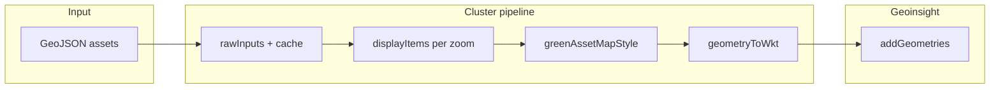

# Piano: stile asset verdi su mappa Geoinsight

**Data:** 2026-07-09  
**Obiettivo:** differenziare visivamente cluster, alberi (punti), linee (filari/siepi) e superfici (prati) rispetto alle **aree verdi gestite** (`GA_*`), senza regressioni su drill-down, cluster e toggle Assets Verdi.

---

## Richiesta funzionale

| # | Elemento | Stile desiderato |
|---|----------|------------------|
| 1 | **Cluster** | Cerchi **azzurri**, raggio/dimensione proporzionale al numero di asset nel cluster |
| 2 | **Alberi (punti)** | Verde **pieno**, pallini leggermente **più piccoli** |
| 3 | **Filari, siepi, linee** | Tratteggiate |
| 4 | **Prati e superfici** | Fill **meno trasparente** delle aree verdi gestite, per distinguerle a colpo d’occhio |

---

## Stato attuale

### Rendering Geoinsight (post-refactor)

- Tutti gli asset e i cluster passano da `greenClusterPipeline.buildGreenClusterLayerPayload`.
- Un solo colore: `GREEN_ASSET_GEOMETRY_COLOR` (`#15803d`) per `GS_*` e `GC_*`.
- I cluster sono `Point` WKT al centroide della griglia (`greenAssetClusterCore.ts`).
- Le **aree gestite** usano `GREEN_AREA_GEOMETRY_COLOR` (`#16a34a`) via `loadGreenLayer(..., { skipClustering: true })`.
- Nessuna distinzione per `geometry_type` (P/L/S) né per `asset_type` (`tree`, `row`, `hedge`, `lawn`, …).

### Riferimento storico (OpenLayers — `cadastre_old_version`)

Il file `greenLayerStyle.ts` implementava già gran parte della logica desiderata:

| Tipo | Stile OL |
|------|----------|
| Cluster | Cerchio verde, raggio `min(12 + log(n)*4, 26)`, testo conteggio |
| Point | Cerchio pieno `GREEN_CORE_RADIUS`, fill opaco |
| LineString | Stroke verde **tratteggiato** `[6, 4]`, width 2.5 |
| Polygon asset | Fill `rgba(72,200,72,0.35)` |

**Gap da colmare:** portare la stessa semantica visiva sull’API Geoinsight `addGeometries`, non su OpenLayers Style.

### Dati backend (invariati)

Proprietà GeoJSON per ogni asset (`green_asset_feature_collection_mapper.py`):

- `asset_type`: `tree`, `row`, `hedge`, `lawn`, `park`, `urban_forest`, `flower_bed`, `street_greenery`, `other`
- `geometry_type`: `P` | `L` | `S` (OBT)
- `geometry.type`: `Point`, `LineString`, `MultiLineString`, `Polygon`, `MultiPolygon`

**Regola di classificazione proposta (frontend):**

```
cluster (isCluster)     → stile cluster
geometry_type === 'P'   → punto (albero/arbusto)
geometry_type === 'L'   → linea (filare, siepe, …)
geometry_type === 'S'   → superficie (prato, parco, …)
fallback                → geometry.type GeoJSON
```

---

## Vincoli API Geoinsight

Documentazione SIV (`docs/geoinsight/riferimento.md`): clip WKT supporta almeno `color` (hex o `[r,g,b,a]`).

**Evidenza cu1.5** (`GeometriaHecRas.tsx`, `crossSections/draw.ts`): clip aggiuntivi usati in produzione:

| Campo | Uso osservato |
|-------|----------------|
| `width` | Dimensione marker punto |
| `stroke_width` | Spessore stroke / cerchio |
| `color` | Fill + stroke base |

**Da verificare con spike (Fase 0):**

- Tratteggio linee: esiste un campo tipo `line_dash` / `stroke_dash` sul clip Geoinsight? Non documentato in SIV; in cu1.5 non risulta usato.
- Come Geoinsight interpreta `width` su `POINT` vs zoom (pixel vs metri).
- Alpha su poligoni: `[r,g,b,a]` vs derivazione alpha da hex.

**Fallback tratteggio** (se API non supporta dash nativo):

1. Pre-processare `LineString` in segmenti alternati (costoso, ultima ratio).
2. Stile lineare alternativo: colore/spessore diverso + documentare limitazione.
3. Richiesta estensione API al team WebGIS.

---

## Palette target (bozza — taratura in Fase 5)

| Token | Valore proposto | Uso |
|-------|-----------------|-----|
| `GREEN_AREA_FILL` | `#16a34a` o `[22,163,74,0.28]` | Aree gestite `GA_*` — **più trasparenti** |
| `GREEN_ASSET_POINT` | `[22,128,61,1]` o `#16803d` | Alberi / punti — **pieno** |
| `GREEN_ASSET_LINE` | `[26,95,42,0.95]` | Filari, siepi — stroke |
| `GREEN_ASSET_SURFACE` | `[72,200,72,0.58]` | Prati, parchi — **meno trasparente** dell’area |
| `GREEN_CLUSTER_FILL` | `[56,189,248,0.75]` | Cluster — **azzurro** (Tailwind sky-400 area) |
| `GREEN_CLUSTER_STROKE` | `[2,132,199,1]` | Bordo cluster (sky-600) |

### Dimensioni

**Cluster** (formula OL, adattata a `width` Geoinsight):

```ts
clusterSizePx = clamp(
  CLUSTER_BASE_PX + Math.log10(memberCount) * CLUSTER_LOG_FACTOR,
  CLUSTER_MIN_PX,
  CLUSTER_MAX_PX,
)
// es. base 14, factor 8, min 14, max 40
```

**Alberi:** `POINT_RADIUS_PX ≈ 5–6` (OL usava `GREEN_CORE_RADIUS`; ridurre ~15–20% rispetto al default attuale).

**Linee:** `stroke_width: 2.5` (allineato OL).

---

## Architettura proposta

### Nuovo modulo puro (testabile)

```
frontend/src/features/territory-map-geoinsight/lib/greenAssetMapStyle.ts
```

Responsabilità:

1. `classifyGreenAssetDisplay(item: ClusterDisplayItem): 'cluster' | 'point' | 'line' | 'surface'`
2. `clusterCircleSizePx(memberCount: number): number`
3. `buildGreenAssetGeometryClip(item, geomId, wkt): GeoinsightGeometryClip` — merge stile + metadati label

Estendere il tipo condiviso:

```ts
// geoJsonToGeoinsight.ts — GeoinsightGeometryClip
export interface GeoinsightGeometryClip {
  // ... campi esistenti
  width?: number
  stroke_width?: number
  line_dash?: number[]   // solo se spike OK
}
```

### Punto di integrazione unico

Modificare **solo** `greenClusterPipeline.buildGreenClusterLayerPayload`:

- Oggi: loop su `displayItems` → stesso `GREEN_ASSET_GEOMETRY_COLOR`.
- Dopo: `buildGreenAssetGeometryClip(item, …)` per item.

`loadGreenLayer` con `skipClustering: true` (aree `GA_*`) resta su `geoinsightGreenLayers.ts` / `geoinsightLayerLoader.ts` — aggiornare lì l’alpha delle aree gestite.

**Non toccare:** algoritmo cluster (`greenAssetClusterCore.ts`), registry, navigazione, toggle.



---

## Fasi di implementazione

### Fase 0 — Spike API Geoinsight (0,5 gg)

Script/browser manuale su Lecce o mock:

1. `POINT` con `width` / `stroke_width` variabili → cerchio azzurro cluster.
2. `LINESTRING` con eventuale `line_dash` → tratteggio visibile.
3. `POLYGON` con `color: [r,g,b,a]` → confronto alpha area vs prato sovrapposti.

**Deliverable:** tabella campi clip supportati + screenshot; eventuale issue WebGIS.

### Fase 1 — Modulo stile + costanti (1 gg)

- [ ] Creare `greenAssetMapStyle.ts` + test unitari (classificazione P/L/S, formula cluster size, colori RGBA).
- [ ] Spostare/centralizzare token colore in `model/constants.ts` o `lib/greenAssetMapStyle.ts`.
- [ ] Estendere `GeoinsightGeometryClip` con campi opzionali verificati in Fase 0.

### Fase 2 — Cluster azzurri scalati (0,5 gg)

- [ ] In `buildGreenClusterLayerPayload`, ramo `item.isCluster`:
  - colore azzurro;
  - `width` / `stroke_width` da `clusterCircleSizePx(memberCount)`.
- [ ] (Opzionale) Label conteggio: solo se Geoinsight supporta `show_label` / testo su point cluster — oggi `hide_label: true`; valutare se riattivare per cluster.

**Test:** zoom 10–13, cluster multipli dimensioni diverse; click cluster → zoom (invariato).

### Fase 3 — Punti albero (0,5 gg)

- [ ] Ramo `geometry_type === 'P'` (e Point): verde pieno, raggio ridotto.
- [ ] Zoom ≥ 14 (asset raw): stesso stile su singoli `GS_*`.

**Test:** alberi visibili ma non dominanti rispetto alle aree; selezione feature OK.

### Fase 4 — Linee tratteggiate (0,5–1 gg)

- [ ] Ramo `geometry_type === 'L'`: applicare dash se supportato.
- [ ] Asset `row`, `hedge` coerenti con seed Lecce (`hedges.geojson` → MultiLineString).

**Test:** siepi/filari distinguibili da confini area; fallback documentato se no dash.

### Fase 5 — Superfici prato vs aree gestite (0,5 gg)

- [ ] `GA_*`: alpha **inferiore** (es. 0.25–0.30) in `geoinsightLayerLoader` / costante dedicata.
- [ ] `GS_*` superfici (`S`, Polygon): alpha **superiore** (es. 0.55–0.65).
- [ ] Toggle Aree Gestite ↔ Assets: contrasto ancora leggibile in entrambe le modalità.

**Test visivo:** stesso comune con prato + contorno area — due livelli di verde distinguibili.

### Fase 6 — QA e documentazione (0,5 gg)

- [ ] Aggiornare `docs/geoinsight/riferimento.md` (tabella colori + campi clip).
- [ ] Aggiornare `docs/geoinsight/cookbook.md` sezione toggle asset.
- [ ] Checklist regressione (sotto).

---

## Checklist regressione

| Scenario | Atteso |
|----------|--------|
| Drill regioni → sub-area foglia | Aree `GA_*` invariate nel flusso |
| Toggle Assets ON | Cluster azzurri a zoom basso |
| Zoom ≥ 14 | Punti/linee/superfici stilizzati per tipo |
| Toggle OFF → restore area | Fix leaf restore (2026-07-09) ancora OK |
| Click cluster | Zoom bbox, no selezione errata |
| Click albero singolo | `handleFeatureSelect` invariato |
| Performance Lecce | Nessun O(n) extra per geometria; solo metadata clip |
| Hard reload / resync | Stili riapplicati dopo `resyncMapLayers` |

---

## Test automatici

| File | Casi |
|------|------|
| `greenAssetMapStyle.test.ts` | classify P/L/S; cluster size monotonic; colori cluster ≠ asset |
| `greenClusterPipeline.test.ts` (nuovo) | payload cluster ha `width` > payload point; line clip ha dash se previsto |

Test visivi manuali obbligatori per alpha e dash (dipendono dal renderer Geoinsight).

---

## Stima effort

| Fase | Giorni |
|------|--------|
| 0 Spike | 0,5 |
| 1 Modulo stile | 1 |
| 2 Cluster | 0,5 |
| 3 Punti | 0,5 |
| 4 Linee | 0,5–1 |
| 5 Superfici / aree | 0,5 |
| 6 QA + docs | 0,5 |
| **Totale** | **~3,5–4 gg** |

Se il tratteggio richiede workaround geometrico: +1–2 gg.

---

## Rischi e mitigazioni

| Rischio | Probabilità | Mitigazione |
|---------|-------------|-------------|
| Geoinsight non supporta dash | Media | Spike Fase 0; fallback spessore/colore; ticket WebGIS |
| `width` punto non scala con zoom | Media | Calibrare valori; eventuale buffer WKT → cerchio poligonale metri |
| Troppi poligoni semi-opachi → map clutter | Bassa | Alpha tuning; stroke sottile su superfici asset |
| Cluster azzurri confusi con layer base map | Bassa | Stroke scuro + bordo; test su tile OSM/WebGIS |

---

## Fuori scope (per ora)

- Stile per specie / `asset_type` oltre P/L/S (es. colore diverso per `flower_bed`).
- Etichette testo su cluster (salvo spike positivo).
- Modifiche backend o seed dati.
- Stile territorio `T_*` o selezione/highlight.

---

## Prossimo passo consigliato

~~Eseguire **Fase 0 (spike)**~~ → **Implementato 2026-07-09** (Fasi 1–6).

### Esito implementazione

| Fase | Stato | Note |
|------|--------|------|
| 0 Spike | Parziale | `width`/`stroke_width` da pattern cu1.5; tratteggio via `dashLineGeometry` (MultiLineString) |
| 1 Modulo stile | ✅ | `lib/greenAssetMapStyle.ts` |
| 2 Cluster | ✅ | Azzurro `[56,189,248,0.82]`, size `log(n)` |
| 3 Punti | ✅ | Verde pieno, 5px |
| 4 Linee | ✅ | Pre-process dash 5m/3.5m gap |
| 5 Superfici / aree | ✅ | Asset S alpha 0.58; aree GA alpha 0.28 |
| 6 Test + docs | ✅ | 16 test; `riferimento.md` aggiornato |

**Verifica manuale consigliata:** drill Lecce → toggle Assets Verdi → zoom cluster / dettaglio.
