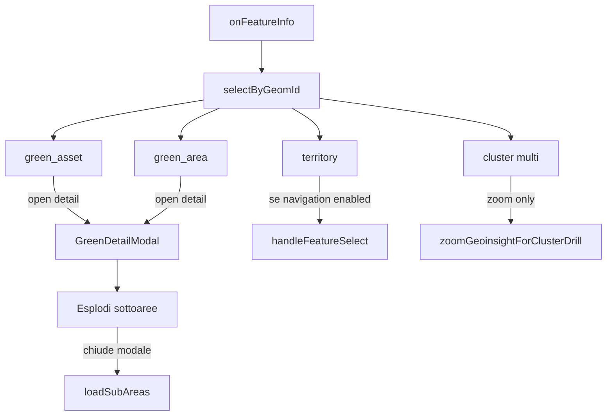

# Dettaglio area/asset verde — Modal al click

**Data:** 2026-07-30  
**Stato:** sostituisce il design hover (`green-detail-popover`)  
**Vincolo UI:** solo componenti **dxc-webkit** (regola `frontend-ui-components-only`).

> **Addendum cutover:** GET detail → lakehouse silver; **`date_from`/`date_to` obbligatori**. Subset campi: [2026-08-12-green-detail-metadata-subset-design.md](./2026-08-12-green-detail-metadata-subset-design.md).

## Obiettivo

Al **click** su un’**area verde** o un **asset verde** in mappa, aprire un **Modal** con scheda dettaglio (summary + METADATI).  
Per le **aree**, dal modale l’utente può decidere se **esplodere le sottoaree** (drill-down).  
Le **aree amministrative** restano con drill immediato al click. L’**hover** non apre il dettaglio.

## Decisioni

| Tema | Scelta |
|------|--------|
| Shell UI | `Modal` dxc-webkit |
| Componente | `GreenDetailModal` (`kind: 'area' \| 'asset'`) |
| Apertura | Click su `green_area` / `green_asset` (sempre, anche con toggle layer spenti) |
| Chiusura | Pulsante Chiudi / toggle modale |
| Drill area | Solo CTA **Esplodi sottoaree** nel modale → `drillGreenArea` / `loadSubAreas` |
| Asset | Solo dettaglio; mai navigazione |
| Admin / territory | Drill immediato; con overlay verdi attivi resta bloccato (niente jump) |
| Cluster multi | Solo zoom; niente modale |
| Dati | Summary da feature/breadcrumb → enrich via API |
| Auth | Cookie + header `fgp` (`authFetch`) |

## Architettura

### Responsabilità

| Unità | Ruolo |
|-------|--------|
| `geoinsightMapSelection` | `green_area`/`green_asset` → `onGreenDetailSelect`; no zoom; territory rispetta freeze overlay |
| `useGreenFeatureDetail` | Apertura click, fetch API, stati `idle \| loading \| ready \| error` |
| `GreenDetailModal` | UI Modal dxc; CTA drill solo per area |
| `drillGreenArea` | Wrapper su `loadSubAreas` da CTA modale |
| `greenDetail.api` | GET detail autenticato |
| BE | Invariato (`GET /green-areas/{id}`, `/green-assets/{id}`) |

## UI

1. Header — titolo i18n + chiusura  
2. Summary — fino a 3 campi  
3. METADATI — griglia 2 colonne  
4. Footer area: **Esplodi sottoaree** + **Chiudi**; asset: solo **Chiudi**

## i18n

Chiavi `territory.panel.detail.*` (incl. `drillSubAreas`).

## Subset metadati (modale)

Contratto e chiavi fisse (sempre presenti; mancanti → `"NaN"`):  
[2026-08-12-green-detail-metadata-subset-design.md](./2026-08-12-green-detail-metadata-subset-design.md)  
Piano: [2026-08-13-green-detail-metadata-subset-plan.md](./2026-08-13-green-detail-metadata-subset-plan.md).
