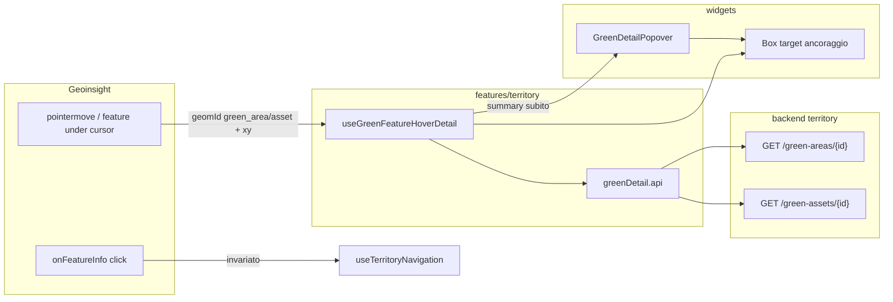
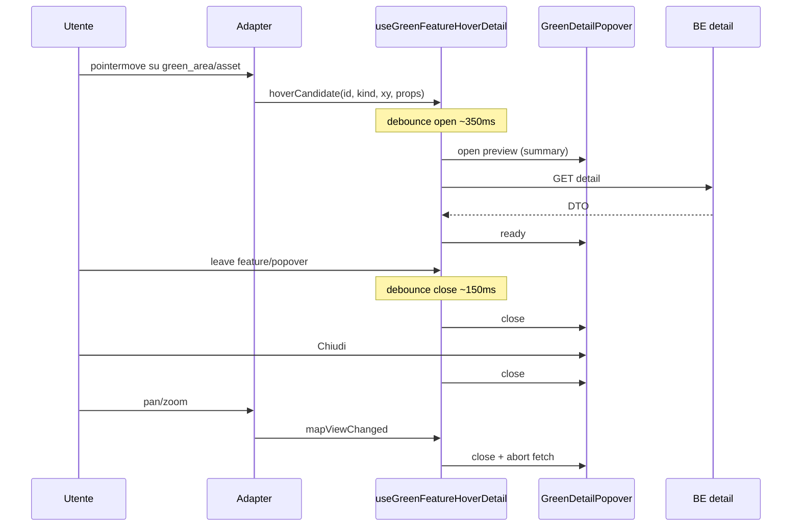

# Dettaglio area/asset verde — Popover al hover

**Data:** 2026-07-30  
**Stato:** **superseded** da [2026-07-30-green-detail-click-modal-design.md](./2026-07-30-green-detail-click-modal-design.md) (click + Modal + drill da CTA)  
**Vincolo UI:** solo componenti **dxc-webkit** (regola `frontend-ui-components-only`).

## Obiettivo

Al passaggio del mouse (hover con breve delay) su un’**area verde** o un **asset verde** in mappa, mostrare una scheda dettaglio in stile CU (header, summary, METADATI), come da mockup prodotto.  
Le **aree amministrative** non aprono il dettaglio. Il **click** resta dedicato al drill-down di navigazione.

## Decisioni

| Tema | Scelta |
|------|--------|
| Shell UI | `Popover` dxc-webkit |
| Componente | Uno solo: `GreenDetailPopover` (`kind: 'area' \| 'asset'`) |
| Apertura | Hover + debounce (~350 ms) |
| Chiusura | Mouse leave (feature + popover, ~150 ms) + pulsante Chiudi + pan/zoom mappa |
| Dati | Ibrido: summary immediato da feature/breadcrumb → enrich via API |
| API campi | Summary + subset curato di metadati (non dump intero modello) |
| Auth | Cookie + header `fgp` (`authFetch`), come le altre API |

## Architettura (approach 1)



### Responsabilità

| Unità | Ruolo |
|-------|--------|
| Adapter Geoinsight | Emette candidati hover: `id`, `layerKind` ∈ `{green_area, green_asset}`, coordinate schermo, props feature. Ignora territory/admin. **Non** fa fetch. |
| `useGreenFeatureHoverDetail` | Debounce open/close, cancel su leave/pan/zoom, stati `idle \| preview \| loading \| ready \| error`, chiama API. |
| `GreenDetailPopover` | Solo UI dxc-webkit. |
| `greenDetail.api` | Client HTTP autenticato verso i nuovi endpoint. |
| BE use case + ctrl | Query by id (PK composita), DTO curato. |

### Non cambia

- Click drill admin e aree verdi  
- Toggle layer Aree gestite / Assets verdi  
- Contratto viewport GeoJSON (props leggere invariati)

## UI — `GreenDetailPopover`

**Componenti ammessi:** `Popover`, `Box`, `Text`, `Button`, `Spinner` (e layout dxc correlati). Nessun `<button>` / `<table>` / `<div>` interattivo raw. Ancoraggio: `Box` con `id` come `target` del Popover.

### Struttura

1. **Header** — titolo i18n `Dettaglio asset` | `Dettaglio area` + `Button` “Chiudi”  
2. **Summary** — fino a 3 coppie chiave/valore in riga (sfondo chiaro)  
   - Asset: es. Specie/Albero · Regione · Comune  
   - Area: es. Nome · Regione · Comune  
3. **METADATI** — griglia 2 colonne con zebra via `Box` + `Text` (non `CustomTable` full-page)  
4. Stati: preview (solo summary) → loading metadati (`Spinner`) → ready / errore breve

### Ancoraggio

- `Box` invisibile / zero-size posizionato a `(clientX, clientY)`  
- `Popover`: `target`, `placement="bottom"`, `color="light"`, `closeOnBlur`  
- Freccia triangolare: solo se supportata dal Popover dxc; non reinventare con CSS custom

### i18n

Chiavi sotto `territory.panel.detail.*` (it/en).

## API backend

### Endpoint

| Risorsa | Metodo | Path |
|---------|--------|------|
| Asset | `GET` | `/api/territory/green-assets/{id}?region_id=&province_id=` |
| Area | `GET` | `/api/territory/green-areas/{id}?region_id=&province_id=` |

PK partizionata: `id` + `region_id` + `province_id` (da feature/registry o breadcrumb).  
Autenticazione: cookie di sessione + header `fgp` (libreria secu / dipendenze esistenti).

### Response (contratto FE)

```ts
type GreenDetailDto = {
  kind: 'asset' | 'area'
  id: number
  summary: {
    /** Titolo riga summary (specie o nome area) */
    primaryLabel: string
    regionLabel?: string
    municipalityLabel?: string
  }
  /** Solo campi valorizzati del subset curato */
  metadata: Array<{ key: string; value: string }>
}
```

### Subset metadati v1 (curato, solo se valorizzati)

**Asset:** `asset_type`, `geometry_type`, `family`, `genus`, `species`, `variety`, `health_status`, `risk_level`, `asset_status`, `managing_entity`, `survey_date`, `growth_stage`, `protection_status`.

**Area:** `name`, `level`, `zril_identifier`, `geometry_type`, `area_classification`, `istat_classification`, `perimeter_type`, `administrative_status`, `operational_status`, `survey_status`, `intensity_of_fruition`, `survey_date`, `start_date_of_management`, `end_date_of_management`.

Label chiave: `key` stabile nel DTO + mappa i18n lato FE.

### Errori

| HTTP | Comportamento UI |
|------|------------------|
| 404 | Messaggio “Dettaglio non disponibile” nei metadati; summary preview può restare |
| 401 | Come resto app (sessione) |
| 5xx | Errore generico breve; retry non obbligatorio in v1 |

## Flusso hover / chiusura



### Regole

- Solo `layerKind` ∈ `{green_area, green_asset}`  
- Cluster con `memberCount > 1`: nessun popover  
- Cambio feature sotto cursore: reset timer + nuovo preview  
- Click: drill invariato; il popover non intercetta il click sulla mappa  
- Feature flag opzionale: `greenDetailPopover` (utile per rollout)

## Struttura file (indicativa)

**Frontend**

- `features/territory/api/greenDetail.api.ts`  
- `features/territory/model/hooks/useGreenFeatureHoverDetail.ts`  
- `features/territory/ui/green-detail/GreenDetailPopover.tsx` (o sotto `widgets/` se pura composizione)  
- Estensione adapter: callback hover + `mapViewChanged`  
- Wire in `TerritoryMapWidget` / `MainContent`

**Backend**

- Use case query `GetGreenAssetDetail` / `GetGreenAreaDetail`  
- DTO output curati  
- Route su `green_asset_ctrl` / `green_area_ctrl`  
- Repository: select by PK composita, soft-delete esclusi

## Test

| Livello | Cosa |
|---------|------|
| Unit hook | Debounce open/close, abort su view change, ignore admin |
| Unit BE | 200 DTO curato, 404, filtro `deleted_at` |
| Smoke UI | Popover apre/chiude con mock; solo dxc-webkit |

## Fuori scope (v1)

- Modifica/edit asset o area dal popover  
- Media gallery  
- Dump completo `attributes` JSONB  
- Dettaglio su feature amministrative  
- Sostituire Accordion tabella verde con questo popover

## Criteri di successo

1. Hover su asset/area verde → scheda dopo ~350 ms con summary poi metadati.  
2. Leave / Chiudi / pan-zoom → chiusura affidabile.  
3. Click area/admin → drill come oggi.  
4. UI costruita solo con dxc-webkit.  
5. Nuove API protette da cookie + FGP e usate dal hook.
