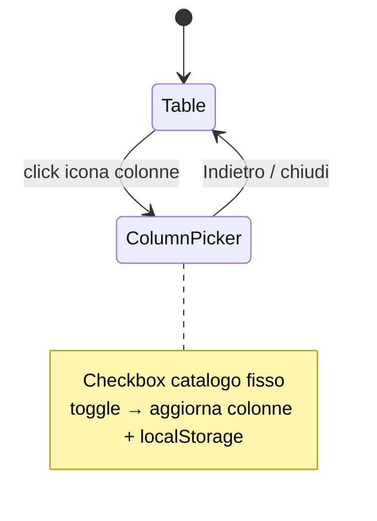

# Tabelle green area/asset — colonne = subset detail + picker in toolbar

**Data:** 2026-08-13  
**Stato:** accepted  
**Piano:** [2026-08-13-green-table-detail-columns-plan.md](./2026-08-13-green-table-detail-columns-plan.md)  
**Correlati:** [2026-08-12-green-detail-metadata-subset-design.md](./2026-08-12-green-detail-metadata-subset-design.md)  
**Vincolo UI:** solo dxc-webkit (`CustomTable`, `Checkbox`, `Button`, `Text`, `Box`, icone documentate).

## Obiettivo

1. Le **stesse informazioni** del modale di dettaglio sono disponibili come colonne nelle tabelle aree / asset.  
2. L’utente sceglie le colonne visibili da un’**icona in toolbar tabella**; può **tornare indietro** (chiudere il picker e rivedere la tabella).  
3. Il selettore colonne nel **InfoPanel** viene **rimosso**; InfoPanel resta per i filtri.

## Decisioni

| Tema | Scelta |
|------|--------|
| Approccio | BE: row table allineate al subset detail; FE: picker in toolbar |
| Catalogo colonne | Solo subset detail (8 area / 15 asset) — nient’altro |
| Default visibili | ~5 prioritarie (liste sotto); resto via picker |
| “Tornare indietro” | Chiude il picker → vista tabella (selezione invariata) |
| Persistenza | `localStorage` separato area vs asset |
| InfoPanel Gestione colonne | Rimosso |
| Celle mancanti | Stesso sentinel detail: stringa `"NaN"` |
| Colonna azioni | `__actions` sempre visibile, sticky destra (invariato) |

## Catalogo colonne (allineato al detail)

### Area (ordine catalogo)

`name`, `area_code`, `area_classification`, `istat_classification`, `intensity_of_fruition`, `perimeter_type`, `survey_date`, `surface_area_m2`

**Default visibili (5):**  
`name`, `area_classification`, `istat_classification`, `perimeter_type`, `surface_area_m2`

### Asset (ordine catalogo)

`plant_code`, `species_code`, `area_code`, `latitude`, `longitude`, `survey_date`, `species`, `genus`, `variety`, `trunk_diameter_cm`, `plant_height_m`, `crown_diameter_m`, `growth_stage`, `protection_status`, `health_status`

**Default visibili (5):**  
`plant_code`, `species`, `genus`, `trunk_diameter_cm`, `health_status`

Regole di derivazione/valore: **identiche** allo spec detail (π, ST_Area, centroid, no `height_class`, ecc.).

**Nota PK:** `plant_code` / `area_code` sono colonne prodotto (non filtrate da `isGreenTableIdColumn`). Le key grezze `id`, `green_area_id`, `region_id`, … restano nel payload per azioni/API ma **non** nel catalogo picker.

## Contratto API table

Endpoint esistenti (invariati path/query):

- `GET …/green-areas/table` (o equivalente paged attuale)
- `GET …/green-assets/table`

Ogni elemento di `data[]` include **sempre** tutte le key del catalogo sopra (valore o `"NaN"`), più gli id tecnici necessari alle azioni (`id`, `region_id`, `province_id`, …).

Label admin (`region_label`, …) possono restare nel payload per filtri legacy / summary, ma **non** compaiono nel picker né nelle colonne selezionabili.

### Sort / filter

- Whitelist BE estesa alle key del catalogo dove il dato è colonna DB o espressione stabile.  
- Campi derivati da JSONB / geometria (`surface_area_m2`, `trunk_diameter_cm`, `latitude`, `longitude`, `plant_height_m`, `crown_diameter_m`, `species_code`):  
  - **v1:** sort/filter abilitati solo se l’espressione SQL è già economica; altrimenti colonna **non sortable** / non filtrabile in UI (header senza sort).  
  - Documentare per key nello implementation plan.

## UI

### Toolbar tabella

- Icona dxc-webkit: `SettingsIcon` (toolbar “Colonne”).  
- Posizione: header tabella (accanto a titolo / controlli esistenti), non nella colonna `__actions`.  
- `aria-label` i18n: `territory.table.columnsToggle`.

### Vista Column picker

- Sostituisce il body tabella (o overlay a piena larghezza del pannello tabella) con:
  - Header: titolo “Colonne” + controllo **Indietro** (`BackNavHeader` se già usato in tabella, o `Button` + icona).  
  - Lista `Checkbox` dxc-webkit per ogni key del catalogo (label = stesse i18n `territory.panel.detail.meta.*` o `labelizeGreenColumn` allineato).  
  - Default già checked; toggle immediato (niente “Applica”).  
- Indietro: chiude picker, mostra di nuovo `CustomTable` con `visibleKeys` correnti.

### InfoPanel

- Rimuovere sezione “Gestione colonne” / checkbox `optionalColumnKeys` da `GreenTablePanelSections`.  
- Contesto: rimuovere o no-op `extraColumns` / `toggleExtraColumn` / `registerTableColumns` legati al picker Info; stato colonne gestito in tabella (+ `localStorage`).  
- Filtri (testo + colonna filtro) restano; opzioni filtro = key del catalogo detail (non id).

## Persistenza

| Key `localStorage` | Valore |
|--------------------|--------|
| `linfa.green-table.visible-cols.area` | `string[]` JSON |
| `linfa.green-table.visible-cols.asset` | `string[]` JSON |

Validazione al load: solo key ∈ catalogo; se vuoto/invalid → default 5.  
Ordine visualizzato = ordine catalogo filtrato per selected (non ordine di click), salvo che si preferisca ordine di selezione — **scelta fissa: ordine catalogo**.

## Architettura FE (unità)

| Unità | Ruolo |
|-------|--------|
| `greenDetailColumnCatalog.ts` (nuovo, shared FE) | Costanti catalogo + default 5; riuso label |
| `greenTableVisibleCols.ts` | read/write `localStorage` + sanitize |
| `GreenDataTable` | toolbar icon, stato `pickingColumns`, colonne da catalogo ∩ storage |
| `GreenTableColumnPicker` (nuovo) | UI checkbox + Indietro |
| `GreenTablePanelSections` | solo filtri |
| `GreenTablePanelContext` | snellito (filtri; niente extra columns) |

## Architettura BE

| Unità | Ruolo |
|-------|--------|
| Helper condiviso (estrarre da `green_detail_out` o modulo `green_metadata_fields`) | Calcolo valori subset da row/attributes/geometry |
| `list_table_rows_paged` aree/asset | Seleziona columns/expressions necessarie; mappa row al subset + id tecnici |
| Sort/filter whitelist | Aggiornata |

Preferire **un’unica funzione di proiezione** usata da detail DTO e da table row builder, per non duplicare π / ST_Area / NaN.

## Fuori scope

- Drag-and-drop riordino colonne.  
- “Ripristina default” esplicito (non richiesto; utente può ri-checkare).  
- Persistenza server-side / per utente autenticato.  
- Nuove colonne oltre al subset detail.

## Criteri di accettazione

1. Tabella area: tra le colonne selezionabili compaiono esattamente le 8 key detail; default 5 come sopra.  
2. Tabella asset: esattamente le 15 key; default 5 come sopra.  
3. Celle senza dato mostrano `"NaN"` (non vuoto / non `—`).  
4. Asset con sola circonferenza: `trunk_diameter_cm` numerico (π).  
5. Area senza `surface_area_m2` in attributes: superficie da geometria se possibile.  
6. Icona toolbar apre picker; Indietro chiude e mostra tabella con selezione invariata.  
7. Reload browser: selezione colonne ripristinata da `localStorage`.  
8. InfoPanel non mostra più Gestione colonne; filtri funzionano sul catalogo.  
9. Azione riga Dettaglio / Assets verdi invariata.

## Rischi

- Performance list con `ST_Area` / centroid / JSONB su pagine grandi → valutare compute in SQL solo per colonne richieste vs sempre (v1: sempre, allineato al “sempre tutte le key”).  
- `localStorage` stale dopo cambio catalogo → sanitize obbligatorio.
