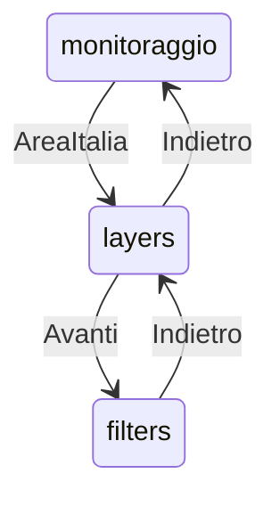

# Filtri multi-campo tabella green — InfoPanel post-Avanti

**Data:** 2026-08-13  
**Stato:** accepted  
**Piano:** [2026-08-13-green-table-multifield-filters-plan.md](./2026-08-13-green-table-multifield-filters-plan.md)  
**Correlati:** [2026-08-13-green-table-detail-columns-design.md](./2026-08-13-green-table-detail-columns-design.md)  
**Vincolo UI:** solo dxc-webkit (`InfoPanel`, `SearchInput`, `Text`, `Box`).

> **Addendum cutover:** filtri AND su table lakehouse (DuckDB); stessi query param date del fetch tabella.

## Obiettivo

Dopo **Avanti** dallo step “Aree gestite e Assets verdi”, mostrare un form di filtri di ricerca con **un campo per ogni colonna del catalogo detail** (stesso del picker Colonne). I filtri non vuoti sono combinati in **AND** sul fetch tabella server-side.

## Decisioni

| Tema | Scelta |
|------|--------|
| UX filtri | Multi-campo: 1 `SearchInput` free-text per key catalogo |
| Combinazione | AND (solo valori non vuoti) |
| Catalogo | Identico a detail/picker: 8 area / 15 asset |
| Persistenza | Solo in-memory nel context (no `localStorage`) |
| Scope | Solo tabella (non layer mappa) |
| `q` globale | Non usato in UI (supporto BE può restare) |
| Wizard | `monitoraggio` → `layers` → `filters` |

## Flusso wizard

- Step `filters`: titolo + lista campi; footer solo **Indietro** (Avanti nascosto o no-op).
- Indietro da filters → layers (toggle e filtri in memoria restano).
- Reset a monitoraggio / landing: azzera filtri area e asset.

## Catalogo campi (ordine)

**Area:** `name`, `area_code`, `area_classification`, `istat_classification`, `intensity_of_fruition`, `perimeter_type`, `survey_date`, `surface_area_m2`

**Asset:** `plant_code`, `species_code`, `area_code`, `latitude`, `longitude`, `survey_date`, `species`, `genus`, `variety`, `trunk_diameter_cm`, `plant_height_m`, `crown_diameter_m`, `growth_stage`, `protection_status`, `health_status`

Catalogo UI = `detailColumnsFor(tableKind)` dove `tableKind` segue la tabella attiva (asset se vista assets, altrimenti area).

## Stato FE

`columnFiltersByKind: { area: Record<string, string>; asset: Record<string, string> }`

- `setColumnFilter(kind, key, value)`
- `clearColumnFilters(kind)`
- Debounce ~300 ms in `GreenDataTable` prima del fetch
- Query: ogni key non vuota → param omonimo su `/table`

## Mapping BE (v1 free-text → SQL)

### Area

| Key | SQL |
|-----|-----|
| `name` | `name ILIKE %v%` |
| `area_code` | `zril_identifier ILIKE %v%` |
| `area_classification`, `istat_classification`, `intensity_of_fruition`, `perimeter_type` | cast text `ILIKE %v%` |
| `survey_date` | cast text `ILIKE %v%` |
| `surface_area_m2` | `attributes->>'surface_area_m2' ILIKE` OR `CAST(ST_Area(geometry::geography) AS text) ILIKE` se attributes assente |

### Asset

| Key | SQL |
|-----|-----|
| `plant_code` | `id = int(v)` (non-int → nessun match) |
| `area_code` | `green_area_id = int(v)` |
| `species_code` | `attributes->>'species_code' ILIKE` |
| `species`, `genus`, `variety` | ILIKE colonne |
| `growth_stage`, `protection_status`, `health_status` | cast text `ILIKE %v%` |
| `survey_date` | cast text `ILIKE %v%` |
| `latitude` / `longitude` | `CAST(ST_Y/ST_X(centroid) AS text) ILIKE` |
| `trunk_diameter_cm`, `plant_height_m`, `crown_diameter_m` | `attributes` JSON path ILIKE (v1) |

Chiavi sconosciute: ignorate (no 400).

## Fuori scope

- Select enum da API, range min/max, persistenza `localStorage`, filtro layer mappa.

## Criteri di accettazione

1. Avanti da layers apre filtri; Indietro torna ai toggle.
2. Tabella aree → 8 campi; tabella asset → 15 campi.
3. N campi valorizzati → AND lato server + paginazione corretta.
4. Clear campo rimuove vincolo; cambio kind conserva filtri dell’altro kind.
5. Nessuna UI “Colonna + Testo” singola.
6. Smoke Lecce: `name`/`species` + enum + `species_code`.
