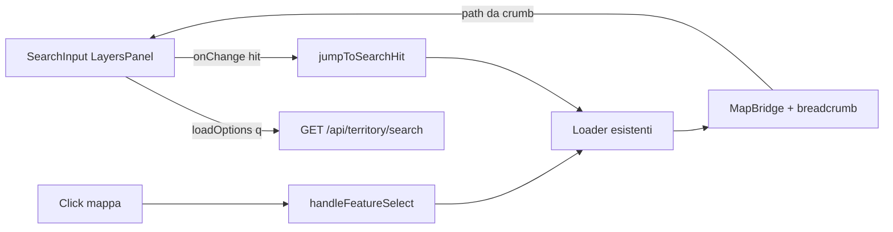

# Ricerca gerarchica territorio — SearchInput nello step Layers

**Data:** 2026-08-13  
**Stato:** accepted  
**Piano:** [2026-08-13-territory-hierarchy-search-plan.md](./2026-08-13-territory-hierarchy-search-plan.md)  
**Vincolo UI:** solo dxc-webkit (`SearchInput`, `Text`, `Toggle` esistenti).  
**Obiettivo correlato:** step wizard `layers` (“Aree gestite e Assets verdi”).

> **Addendum cutover 2026-09-04:** la typeahead BE cerca **solo** livelli admin in `public.*` (regions → … → sub_municipal_area).  
> **Non** interroga più `cadastre.green_areas` (tabella rimossa). Il livello UI `green_areas` / `sub_areas` resta nel drill mappa e nei jump FE, ma **non** come hit search SQL.  
> Vedi [2026-09-04-green-lakehouse-only-pg-drop-design.md](./2026-09-04-green-lakehouse-only-pg-drop-design.md).

## Obiettivo

Introdurre **prima dei toggle** un filtro di ricerca testuale che permette di raggiungere un’area amministrativa o una green/sub-area con **la stessa navigazione** del click sulla mappa (breadcrumb, loader, fit), senza regressioni sul flusso attuale (toggle, viewport verde, filtri tabella, detail).

Esempi path in dropdown:

- `Italia - Puglia`
- `Italia - Puglia - Lecce Provincia`
- `Italia - Puglia - Lecce Provincia - Lecce - Santa Rosa`
- … fino a Area / Sub Area

Default / clear → **territorio nazionale** (`loadRegions`).

## Decisioni

| Tema | Scelta |
|------|--------|
| Approccio | Endpoint BE typeahead + jump FE sui loader esistenti |
| Selezione hit | Identica al drill click (stessi loader / breadcrumb) |
| Clear / vuoto | `loadRegions()` (vista Italia) |
| Sync search ↔ mappa | Bidirezionale: breadcrumb aggiorna la SearchInput anche dopo click mappa |
| Overlay toggle ON | Click mappa resta bloccato; **search jump permesso** (altrimenti inutilizzabile nello step layers) |
| Asset singoli | Fuori scope (solo admin + green area / sub-area) |
| UI control | `SearchInput` con `loadOptions` async + debounce |

## Architettura



- **Non** duplicare la logica di `handleFeatureSelect` nel senso di ricalcolare i drill: `jumpToSearchHit` costruisce lo stack id/label e invoca i **loader già usati** (`loadRegions`, `loadProvinces`, `loadMunicipalities`, `loadSubMunicipalAreas`, `loadGreenAreas`, `loadSubAreas` / `restoreMapForBreadcrumb`).
- I viewport verdi (aree/asset) **seguono già** il breadcrumb via `useGreenAssetsLayer`; il jump non deve reimplementare i toggle.

## Contratto API

### `GET /api/territory/search`

| Param | Tipo | Note |
|-------|------|------|
| `q` | string | Testo libero; trim; case-insensitive |
| `limit` | int | Default 20, max ragionevole (es. 50) |

**`q` vuoto:** risposta con un solo hit “Italia” (o array vuoto + FE che tratta clear come Italia). Preferenza: hit esplicito Italia per coerenza dropdown.

**Hit (JSON):**

```json
{
  "value": "municipality:5998",
  "label": "Italia - Puglia - Lecce Provincia - Lecce",
  "level": "municipalities",
  "id": 5998,
  "region_id": 16,
  "province_id": 75,
  "municipality_id": 5998,
  "sub_municipal_area_id": null,
  "green_area_id": null
}
```

| Campo | Uso |
|-------|-----|
| `value` | Chiave stabile `SearchInput` (`{level}:{id}`) |
| `label` | Path visualizzato (`Italia - …`) |
| `level` | `regions` \| `provinces` \| `municipalities` \| `sub_municipal_areas` \| `green_areas` \| `sub_areas` \| `italy` |
| `id` | Id del nodo selezionato |
| `*_id` parent | Catena per ricostruire breadcrumb / chiamare loader |

**Match SQL (v1, post-cutover):** `ILIKE '%q%'` su `name` di:

- `public.regions`
- `public.provinces` (label path con suffisso provincia allineato a i18n breadcrumb)
- `public.municipalities`
- `public.sub_municipal_area`

~~`cadastre.green_areas`~~ — **rimosso** (nessuna tabella green in PG; search non emette hit `green_areas` / `sub_areas`).

Path costruito server-side con JOIN sulla gerarchia. Ordine risultati: per livello (regione → … → sub-area) poi nome, oppure rilevanza prefix-match prima di contains.

## Flusso FE

### UI (`LayersPanel`)

1. Titolo / descrizione esistenti.
2. **`TerritorySearchInput`** (wrapper su `SearchInput`).
3. Toggle aree / asset (invariati).

Props tipiche SearchInput: `label`, `placeholderText`, `PlaceholderIcon` (`SearchIcon`), `loadOptions`, `debounceTimeMillis` (~300), `isClearable` / `onClear`, `value` controlled.

### Selezione

1. Utente sceglie un’option.
2. `jumpToSearchHit(hit)`:
   - `italy` / clear → `loadRegions()`.
   - Altrimenti setta `level` + `breadcrumb` coerenti con i loader, poi carica GeoJSON figli come farebbe il click a quel livello.
3. Nessuna modifica al motore Geoinsight oltre a quanto già fanno i loader.

### Sync da mappa

- Derivare il testo/valore SearchInput dal `breadcrumb` corrente:
  - crumb vuoto → `Italia`
  - altrimenti `Italia - ` + labels crumb join ` - ` (stesso formato delle option).
- Evitare loop: aggiornamento da breadcrumb non deve ri-sparare `jumpToSearchHit`.

### Clear

`onClear` e selezione “Italia” → `loadRegions()` (fit nazionale come oggi).

## Eccezione overlay vs click

| Azione | Toggle aree/asset OFF | Toggle ON |
|--------|----------------------|-----------|
| Click feature territorio | Drill (`handleFeatureSelect`) | Bloccato (invariato) |
| Search jump | Drill via loader | **Consentito** — aggiorna breadcrumb; viewport verde risegue lo scope |

Razionale: la search vive nello step layers dove i toggle sono il caso d’uso principale.

## Edge case

- Nessun match → lista vuota; mappa invariata.
- Jump concorrente → rispettare `navigateInProgressRef` / serializzare.
- Nomi ambigui → disambiguati dal path completo.
- Fallimento API search → nessun jump; feedback utente (toast o helperText).
- Fallimento a metà jump → non lasciare breadcrumb orfano (completare via `restoreMapForBreadcrumb` o non applicare crumb finché il load non riesce).
- Reset wizard / landing → search allineata a Italia + stato panel come oggi.

## Fuori scope

- Ricerca per codice ISTAT / plant_code / asset id.
- Modifica comportamento toggle, filtri tabella, detail modal.
- Sostituzione breadcrumb UI in header (resta; search è aggiuntiva nello step layers).

## File previsti

| Area | File |
|------|------|
| BE | Repository + controller search su router territory (`/api/territory/search`) |
| FE API | `territory.api` — `searchTerritory(q)` |
| FE nav | `jumpToSearchHit` su `useTerritoryNavigation` (o modulo dedicato chiamato dall’hook) |
| FE UI | `TerritorySearchInput` + integrazione `LayersPanel`; accesso a `nav` via context/callback dal widget |
| i18n | Label/placeholder search (it/en) |
| Docs | Questo design; piano implementazione a seguire |

## Criteri di accettazione

1. Digito “Puglia” → option `Italia - Puglia` → selezione = stesso stato di click regione Puglia.
2. Digito “Santa Rosa” → path completo → stesso stato di drill a quel nodo.
3. Clear → vista nazionale regioni.
4. Click mappa (toggle OFF) → SearchInput mostra path aggiornato.
5. Con toggle ON: search jump aggiorna scope; toggle, tabella, filtri, detail non regressivi.
6. Solo componenti UI da whitelist dxc-webkit / shared documentati.

## Piano

[2026-08-13-territory-hierarchy-search-plan.md](./2026-08-13-territory-hierarchy-search-plan.md)
