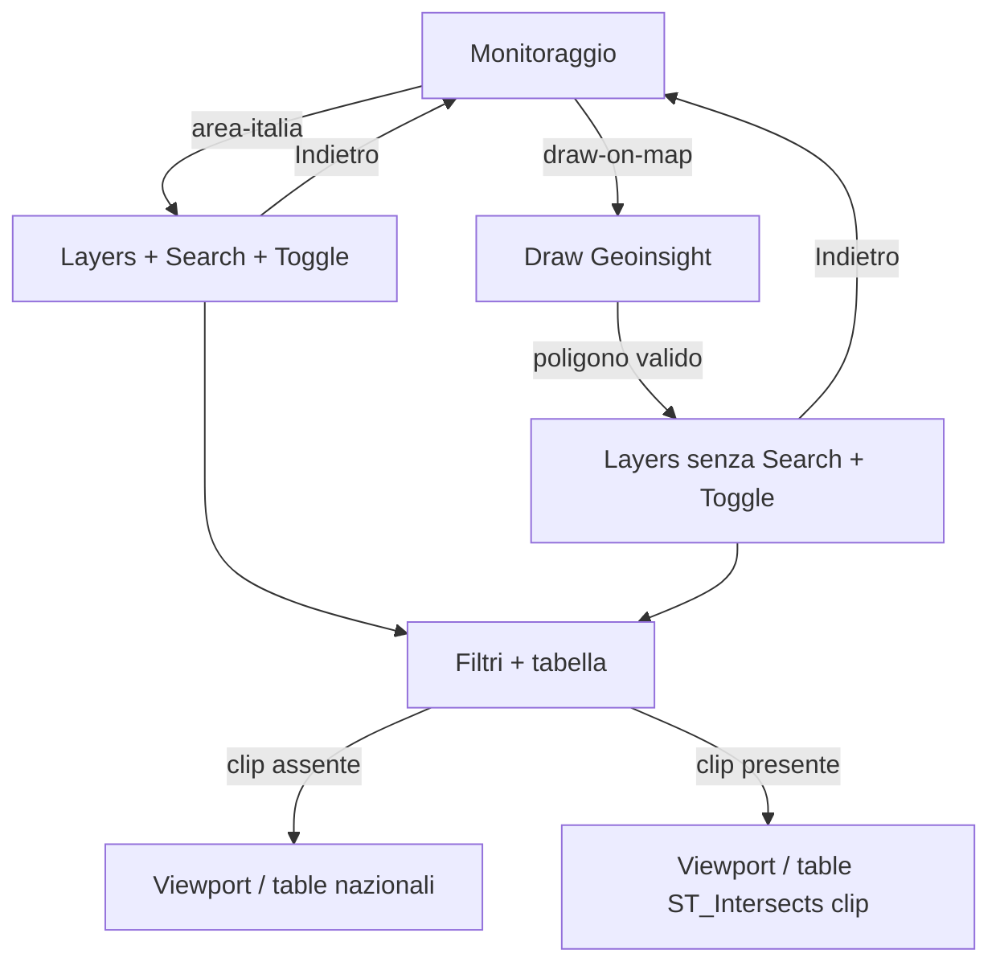

# Disegna su mappa — clip spaziale (stesso wizard di Area Italia)

**Data:** 2026-08-18  
**Stato:** accepted  
**Piano:** [2026-08-18-draw-on-map-spatial-clip-plan.md](./2026-08-18-draw-on-map-spatial-clip-plan.md)  
**Vincolo UI:** solo dxc-webkit / wrapper già usati (List/ListItem Monitoraggio, Toggle Layers, filtri tabella). Nessun controllo draw custom: strumento nativo Geoinsight.  
**Obiettivo correlato:** voce Monitoraggio `draw-on-map` (oggi TODO in `InfoPanelContent`).

## Obiettivo

Consentire di **disegnare un poligono** sulla mappa Geoinsight e mostrare aree gestite / asset verdi **solo** se intersecano quel poligono, anche dopo pan/zoom fuori dal disegno.

Riuso del flusso Area Italia: stessi toggle, stessi filtri tabella, stesso accordion/dettaglio. Nessuna search gerarchica né drill amministrativo in questo ingresso.

## Decisioni

| Tema | Scelta |
|------|--------|
| Approccio | Scope spaziale **ortogonale** a `GreenContext` (clip), non un secondo wizard |
| Clip | Poligono stretto (`ST_Intersects`); non il solo bbox del disegno |
| Search / drill | Assenti in ingresso `draw` (V1) |
| Poligoni | Uno; ridisegno = Indietro → Monitoraggio → Disegna di nuovo |
| Toggle / filtri | Identici ad Area Italia (default entrambi OFF) |
| Ingresso Layers | Solo **dopo** `onGeometryDrawn` valido |
| Indietro | `resetToLanding` + cancellazione disegni + clip nullo |

## Architettura



- **Area Italia:** `GreenContext` vuoto, nessun clip. Search e drill invariati.
- **Disegna:** `GreenContext` vuoto + `spatialClip` (GeoJSON Polygon). Search nascosta; click territorio **disabilitato** (altrimenti un drill romperebbe il recinto).
- I viewport verdi restano su `loadGreenLayerViewport`; i fetcher aggiungono `clip_wkt` solo se `entryMode === 'draw'`.
- Gate regressione: se l’ingresso non è `draw`, FE **non** invia `clip_wkt`.

## Contratto API

Parametro opzionale **`clip_wkt`**: WKT `POLYGON` o `MULTIPOLYGON` in EPSG:4326.

Applicare a:

- `GET /api/territory/green-areas/viewport`
- `GET /api/territory/green-areas/table`
- `GET /api/territory/green-assets/viewport`
- `GET /api/territory/green-assets/table`

Predicato aggiuntivo (AND con filtri esistenti):

```sql
ST_Intersects(geometry, ST_GeomFromText(:clip_wkt, 4326))
```

Viewport: **clip AND bbox** della vista (paging mappa).  
Tabella: clip + stessi filtri colonna/paginazione di oggi; senza id amministrativi = “nazionale ma dentro il poligono” (radici aree come Area Italia, asset senza `green_area_id`).

Cluster asset: si usano le matview precalcolate anche con clip. Admin: `ST_Intersects(centroid, clip)` (a zoom regione/provincia si forzano i comuni). Grid: `ST_Intersects(extent, clip)`. I count restano i totali dell’unità/cella, non il sottoinsieme stretto del poligono. Raw e tabella restano `ST_Intersects` sulla geometria.

| Caso | Comportamento |
|------|----------------|
| `clip_wkt` assente | Identico a oggi |
| WKT invalido / non poligono | `400` |
| Troppo lungo (cap FE ~256 vertici) | FE semplifica prima della GET; se ancora eccessivo, `400` |
| Nessuna feature nel clip | Collection/tabella vuota (`total: 0`), non errore |

Non introdurre POST dedicati in V1: il poligono utente è piccolo.

## Flusso FE

### Monitoraggio

1. Click **Disegna su mappa** → `entryMode = 'draw'`, si **resta** su Monitoraggio, `activateDrawGeometry`.
2. `onGeometryDrawn` → Polygon GeoJSON valido (anello chiuso, ≥ 4 posizioni, no self-intersect) → `deactivateDrawGeometry`, salva `spatialClip`, `goToLayers`.
3. Geometria invalida / abort: toast, draw resta ON, niente Layers.
4. Click **Area Italia** (o deselezione) durante il draw: `deactivateDrawGeometry` + `deleteAllDrawnGeometries`, `entryMode = 'admin'`, clip nullo, flusso Italia.

### Layers (`draw`)

- Stesso `LayersPanel` e `GreenLayerToggles`.
- **Non** montare `TerritorySearchInput`.
- Overlay poligono visibile (geometria Geoinsight disegnata, non un secondo layer inventato).
- Toggle ON → `useGreenAssetsLayer` come oggi, fetcher con `clip_wkt`.
- `greenContextKey` (o equivalente) include un fingerprint del clip così il viewport si riallinea quando il clip arriva.

### Filtri / tabella / dettaglio

- `buildGreenAreasTableQuery` / `buildGreenAssetsTableQuery`: se clip presente, aggiungono `clip_wkt`; **non** usano `contained_in_area_id` da search (search assente).
- Accordion, filtri colonna, paginazione, detail modal: invariati.
- Lock toggle da search green: non si applica (`entryMode !== 'draw'`).

### Reset

`goToMonitoraggio` già chiama `resetToLanding` + `resetPanelState`. Estendere il reset con: `deleteAllDrawnGeometries`, `spatialClip = null`, `entryMode = 'admin'`, draw OFF.

## Edge case

- Pan/zoom fuori dal poligono: le API possono essere chiamate (bbox vista) ma **nessuna** feature con geometria esterna al clip.
- Draw concorrente / doppio complete: serializzare; un solo clip.
- StrictMode / remount mappa: clip in context, non solo in closure del widget; al ready se `entryMode === 'draw'` e clip già presente, non riattivare il draw.
- Click feature verde con toggle ON: dettaglio come Area Italia (non drill).
- Breadcrumb header: resta vuoto/Italia; non sintetizzare crumb fittizi dal poligono.

## Fuori scope (V1)

- Ridisegno / edit / più poligoni nello step Layers.
- Search o drill amministrativo *dentro* il recinto.
- Voci Monitoraggio upload / cerca aree / cerca asset.
- Clip solo client-side.
- POST body per il clip.

## File previsti

| Area | File |
|------|------|
| BE | `green_area_ctrl` / `green_asset_ctrl` + repository viewport e `list_table_rows_paged` |
| FE context | `GreenTablePanelContext` — `entryMode`, `spatialClip` |
| FE wizard | `InfoPanelContent` — ramo `draw-on-map`; `LayersPanel` — search condizionale |
| FE map | MapBridge + `GeoinsightRef` (`activateDrawGeometry`, `onGeometryDrawn`, `deleteAllDrawnGeometries`) |
| FE data | `useGreenAssetsLayer`, `greenAreaMap.api` / `greenAssetMap.api`, `greenTableParams` |
| i18n | Eventuali stringhe errore draw (it/en) |
| Docs | Questo design; piano implementazione a seguire |

## Criteri di accettazione

1. Area Italia: search, drill, toggle, filtri, tabella **invariati** (nessun `clip_wkt` in rete).
2. Disegna → poligono → Layers senza search; toggle aree/asset e filtri funzionano.
3. Mappa e tabella mostrano solo record che intersecano il poligono; pan fuori non fa comparire altro.
4. Indietro: Monitoraggio, niente overlay disegno, dati nazionali di nuovo solo dopo nuovo ingresso Area Italia.
5. Draw abortito / WKT invalido: nessun ingresso Layers, toast, mappa usabile.
6. Solo UI whitelist dxc-webkit + Geoinsight draw nativo.

## Piano

[2026-08-18-draw-on-map-spatial-clip-plan.md](./2026-08-18-draw-on-map-spatial-clip-plan.md)
