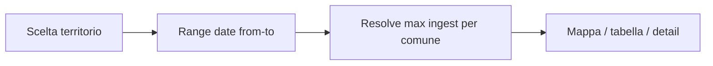
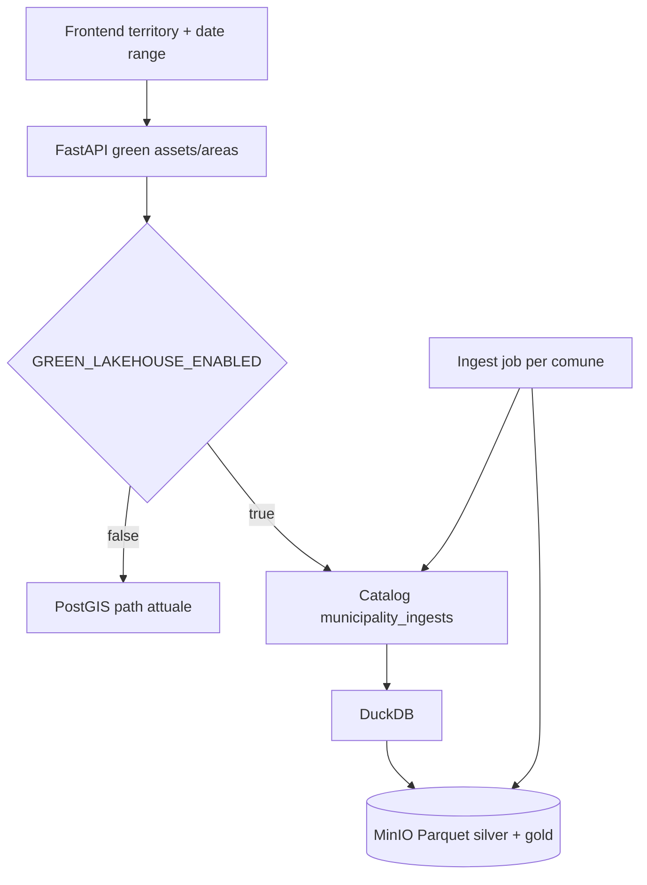

# Lakehouse green assets / aree — MinIO + DuckDB (FastAPI)

**Data:** 2026-09-04  
**Stato:** accepted (T0–T7); **parzialmente superseded**  
**Cutover lakehouse-only / drop PG green:** [2026-09-04-green-lakehouse-only-pg-drop-design.md](./2026-09-04-green-lakehouse-only-pg-drop-design.md)  
**Piano / tasklist (storico T0–T7):** [2026-09-04-green-lakehouse-minio-duckdb-plan.md](./2026-09-04-green-lakehouse-minio-duckdb-plan.md)  
**Stack:** Parquet partizionato su **MinIO (S3)** + **DuckDB in-process** nel backend FastAPI  

> **Superseded per cutover:** feature flag `GREEN_LAKEHOUSE_ENABLED`, dual-path PostGIS, profile compose `lakehouse`, export PG→MinIO come path primario di scrittura, rollback = flag OFF. Restano validi: layout Parquet, risoluzione temporale per comune, gold clusters, contratti API path/shape.

## Obiettivo

Servire la **visualizzazione** (mappa viewport/cluster, tabella, dettaglio mappa) di **green assets** e **green areas** da un lakehouse temporale su object storage, non da PostGIS.

Motivo: i dati sono aggiornati con cadenza diversa **per comune**; l’utente deve scegliere un **territorio**, poi un **range di date**, e vedere per ogni comune nel territorio il batch **più recente** con `ingest_at` contenuto nel range.

PostGIS resta fuori dal serving path viz green in target (può restare fonte di export/admin o layer territoriali non-green).

## Decisioni

| Tema | Scelta |
|------|--------|
| Storage | MinIO (API S3) |
| Formato | Parquet hive-partitioned |
| Query serving | DuckDB in-process in FastAPI (`httpfs` → MinIO) |
| Motore tabella | Non Iceberg/Delta in V1 (complicazione inutile); catalog + path immutabili |
| Temporale UI | Territorio → `date_from` / `date_to` → mosaico **max(ingest_at) per comune** nel range |
| Ingest | Indipendente per `municipality_id` + `ingest_date` |
| Cluster UX | **Gold** precomputato all’ingest per bande zoom; raw solo a zoom alto |
| Anti-regressione | Feature flag `GREEN_LAKEHOUSE_ENABLED` (default OFF); stessi contract response |
| Rollout | Fasi T0–T7 pinnabili nel plan |

## Flusso utente



1. L’utente seleziona il territorio (regione / provincia / comune / … come oggi).
2. Immette `date_from` e `date_to`.
3. Per ogni `municipality_id` nel territorio:  
   `ingest_at* = max { ingest_at | date_from ≤ ingest_at ≤ date_to }`.
4. Si caricano solo i Parquet (silver/gold) di quelle coppie `(municipality_id, ingest_at*)`.
5. Se nessun comune ha ingest nel range → risposta vuota (non errore 500) + messaggio UI.

## Architettura



### Layout object storage (esempio)

Bucket: `cadastre-lake` (nome configurabile).

```
s3://cadastre-lake/
  green_assets/
    region_id=R/province_id=P/municipality_id=M/ingest_date=YYYY-MM-DD/
      part-*.parquet
  green_areas/
    region_id=R/province_id=P/municipality_id=M/ingest_date=YYYY-MM-DD/
      part-*.parquet
  green_assets_clusters/
    region_id=R/province_id=P/municipality_id=M/ingest_date=YYYY-MM-DD/zoom_band=B/
      part-*.parquet
  green_areas_clusters/   # se necessario
    ...
  _catalog/
    municipality_ingests.parquet
```

**Catalog** (minimo): `municipality_id`, `region_id`, `province_id`, `ingest_at` (date/timestamp), `dataset` (`assets`|`areas`), `object_prefix`, `row_count`, `checksum`, `written_at`.

### Risoluzione temporale (ogni request)

1. Espandi territorio → set `municipality_id`.
2. DuckDB sul catalog: per ogni comune e dataset, `max(ingest_at)` filtrato dal range.
3. Costruisci lista path/glob Parquet; `read_parquet(..., hive_partitioning=true)`.
4. Applica `bbox` / `clip_wkt` / filtri / bande zoom.
5. Zoom basso → gold clusters; zoom alto → silver raw (con cap feature come oggi).

## Contratto API

Endpoint esistenti invariati nel path e nel **response shape**:

- `GET /api/territory/green-assets/viewport|table|{id}`
- `GET /api/territory/green-areas/viewport|table|{id}`

**Nuovi query param** (post-cutover: **sempre obbligatori** su green viz/catalog/table/detail):

| Param | Tipo | Note |
|-------|------|------|
| `date_from` | ISO date | Inizio range (incluso); **sempre obbligatorio** |
| `date_to` | ISO date | Fine range (incluso); **sempre obbligatorio** |

Territorio: già coperto da `region_id` / `province_id` / `municipality_id` / …  
`clip_wkt`, `bbox`, `zoom`, `format` restano come oggi ([draw-on-map design](./2026-08-18-draw-on-map-spatial-clip-design.md)).

Validazione: `date_from ≤ date_to`; assenti → **400** (`date_from and date_to are required`).

## Ingest (per comune)

1. Input batch + `ingest_at` (data del carico per quel comune).
2. Scrive silver Parquet sotto staging prefix.
3. Genera gold cluster per bande zoom allineate alle soglie FE/BE esistenti.
4. Swap atomico staging → path definitivo.
5. Upsert riga catalog.
6. Idempotenza: stesso `(municipality_id, ingest_date, dataset)` sovrascrive in modo atomico.
7. Fallimento prima dello swap: catalog invariato → letture precedenti intatte.

## Performance (serving + UX)

| Leva | Come |
|------|------|
| Partition prune | Solo comuni del territorio + ingest risolti |
| Gold cluster | Niente aggregazione 8M punti a runtime a zoom basso |
| Proiezione colonne | Solo props mappa/table page; detail path dedicato se pesante |
| DuckDB | Thread-local / pool piccolo; `httpfs` MinIO; catalog in cache TTL (30–60s) invalidabile post-ingest |
| FE | Debounce viewport invariato; refetch su change range; non remount layer admin |
| Payload | Geobuf/cap feature come oggi |
| Observability | p95 viewport, #file parquet aperti, cache hit; rollback = flag OFF |

## Anti-regressione

- Default flag **OFF** → comportamento PostGIS attuale invariato.
- Dual repository dietro stessa interfaccia usecase.
- Test di parità su comune pilota (stesso bbox/zoom) prima del cutover.
- Draw-on-map / filtri tabella / detail: stessi wire contract; cambia solo la fonte dati dietro il repository.
- Layer territoriali admin (regioni/province/comuni) non sono oggetto di questo design salvo note esplicite future.

## Fuori scope V1

- Apache Iceberg / Delta / Hudi.
- Motore SQL distribuito (Trino/Spark) in serving path.
- Sostituzione PostGIS per confini amministrativi.
- Cache Redis distribuita (valutare in T7 se p95 insufficiente).

## Riferimenti docs allineati

- Layout Parquet / catalog: [../infrastructure/lakehouse-parquet-layout.md](../infrastructure/lakehouse-parquet-layout.md)
- Plan tasklist: [2026-09-04-green-lakehouse-minio-duckdb-plan.md](./2026-09-04-green-lakehouse-minio-duckdb-plan.md)
- Mapping DB: [../database/design/database-mapping-diagram.md](../database/design/database-mapping-diagram.md) (nota serving lakehouse)
- Ottimizzazioni PostGIS storiche: [../database/design/optimization/optimization_analysis.md](../database/design/optimization/optimization_analysis.md)
- FE moduli: [../../frontend/docs/design/modular-package-structure.md](../../frontend/docs/design/modular-package-structure.md)
- Infra MinIO: [../infrastructure/minio-lakehouse.md](../infrastructure/minio-lakehouse.md)
