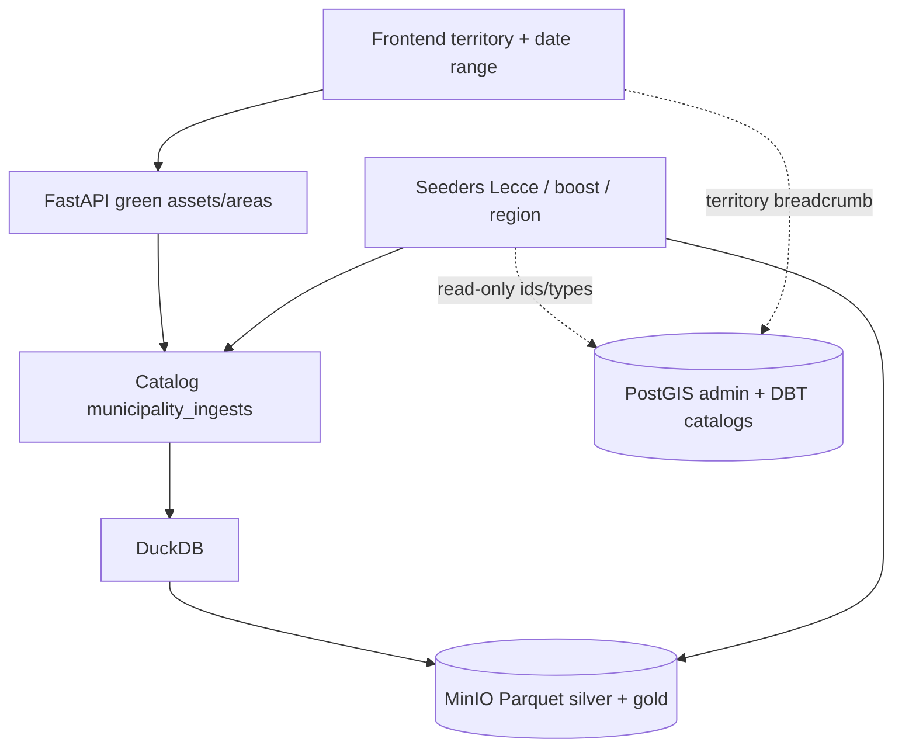

# Lakehouse-only green — drop PostGIS green + compose consolidation

**Data:** 2026-09-04  
**Stato:** accepted  
**Approccio:** big-bang (wipe & recreate ambiente di sviluppo)  
**Plan:** [2026-09-04-green-lakehouse-only-pg-drop-plan.md](./2026-09-04-green-lakehouse-only-pg-drop-plan.md)  
**Supersedes (serving/anti-regressione):** parti di [2026-09-04-green-lakehouse-minio-duckdb-design.md](./2026-09-04-green-lakehouse-minio-duckdb-design.md) relative a feature flag, dual-path PostGIS e profile MinIO opzionale.  
**Layout Parquet / query:** restano validi [../infrastructure/lakehouse-parquet-layout.md](../infrastructure/lakehouse-parquet-layout.md) e il serving DuckDB già implementato (T3–T7).

## Obiettivo

Eliminare le tabelle PostgreSQL/PostGIS del dominio **green** (aree, asset, history, matview cluster) e servire la visualizzazione **solo** dal lakehouse MinIO (Parquet + DuckDB). Allineare seeders, compose e documentazione. Nessuna regressione funzionale sul flusso territorio → range date → mappa/tabella/detail.

## Decisioni chiuse

| Tema | Scelta |
|------|--------|
| SoR green viz | Solo MinIO (silver + gold + catalog) |
| PostGIS green | Nessun dato green residuo |
| Scope DROP schema | `green_areas`, `green_assets`, `asset_green_history` (+ partizioni) + matview `green_asset_admin_clusters` / `green_asset_grid_clusters` |
| Ambienti esistenti | **Ex novo**: niente ALTER/migration; `docker compose down -v` + reiniz |
| MinIO compose | Sempre avviato (niente profile `lakehouse`) |
| Env | Solo `.env` / `.env.example`; eliminare `lakehouse.env.example` e `docker-compose.lakehouse-on.yml` |
| Seed | Seeders scrivono **direttamente** MinIO; rimuovere export PostGIS → lakehouse |
| Feature flag | Rimuovere `GREEN_LAKEHOUSE_ENABLED` e dual-path |
| History green | Nessun sostituto lakehouse in V1 |
| Docs | Aggiornamento obbligatorio e completo a ogni cambio |

## Architettura target

### Resta in PostGIS

- `public.regions`, `provinces`, `municipalities`, `sub_municipal_area`
- `area_level`, `attribute_types` (e cataloghi DBT correlati)
- API territorio / breadcrumb admin

### Via da PostGIS

- Tabelle `cadastre.green_areas`, `cadastre.green_assets`, `cadastre.asset_green_history` (+ default e partizioni)
- Matview `cadastre.green_asset_admin_clusters`, `cadastre.green_asset_grid_clusters`
- Script init `07-…`, `08-…`; parti green di `02-…`, `04-…`, `06-…`
- ORM `GreenAreaModel`, `GreenAssetModel`, `AssetGreenHistoryModel`
- Repository PostGIS green e factory dual-path
- ENUM `cadastre.*` usati **solo** da quelle tabelle (rimuovere se non referenziati altrove)
- Schema `cadastre`: può restare vuoto o essere rimosso se non rimane nulla

### Fuori scope

- Iceberg / Delta / Trino
- History green su object storage
- Sostituzione confini amministrativi PostGIS
- Migrazioni in-place su DB già popolati

## Contratto API

Path e **response shape** invariati:

- `GET /api/territory/green-assets/viewport|table|{id}`
- `GET /api/territory/green-areas/viewport|table|{id}`
- `POST /api/territory/lakehouse/catalog/invalidate` (resta)

| Param | Policy |
|-------|--------|
| `date_from` / `date_to` | **Sempre obbligatori** su endpoint green viz (non più gated dal flag) |
| Territorio, `bbox`, `zoom`, `clip_wkt`, `format` | Come oggi |

Validazione: `date_from ≤ date_to`; assenti → 400. Nessun ingest nel range → risposta vuota (non 500).

## Compose e configurazione

1. Servizi `minio` e `minio-init` **senza** `profiles`.
2. `backend.depends_on` include MinIO healthy.
3. Variabili lakehouse (`LAKEHOUSE_S3_ENDPOINT`, credenziali, bucket, …) solo in `.env` / `.env.example`.
4. Eliminare:
   - `infrastructure/compose/docker-compose.lakehouse-on.yml`
   - `infrastructure/compose/lakehouse.env.example`
5. Rimuovere ogni riferimento a `GREEN_LAKEHOUSE_ENABLED` da compose, settings, docs, test.

Workflow dev: `docker compose down -v && docker compose up -d` → stack pulito.

## Seed → lakehouse

| Oggi | Target |
|------|--------|
| `load_lecce_green_data.py` → INSERT PG | Stesso parsing GeoJSON → Parquet silver + gold + upsert catalog |
| `boost_municipality/*.sql` | Rewrite che scrive lakehouse (lookup admin via PG read-only) |
| `seed_populate_region_data.sql` | Pipeline Python → MinIO; SQL green PG eliminato |
| `export_municipality_to_lakehouse.py` (+ runner) | **Rimosso** |

Dopo seed: aggiornare `_catalog/municipality_ingests.parquet` e, se backend già up, invalidare cache catalog.

Gold: riuso logica `gold_clusters.py` / bande zoom già definite.

## Backend / Frontend

**BE**

- Wiring: solo `*LakehouseRepository`.
- Rimuovere settings/flag, gate DuckDB, branch `http_dates` legati al flag.
- Test: da dual-path a lakehouse-only.

**FE**

- Date range già nel flusso Layers: resta obbligatorio.
- Pulire commenti/copy “se lakehouse ON”.
- Empty period UX invariata nella sostanza.

## Anti-regressione (smoke post-wipe)

1. Stack up con MinIO + PostGIS admin.
2. Seed Lecce (o boost) → oggetti su bucket + catalog.
3. Viewport zoom basso (gold) e alto (silver), table, detail, clip WKT.
4. Verificare assenza tabelle `cadastre.green_*` / matview.
5. Rollback = revert git + wipe volumi (niente flag OFF).

## Documentazione da aggiornare (obbligatoria)

| Documento | Azione |
|-----------|--------|
| Questo design | Source of truth cutover |
| Plan collegato | Tasklist implementazione |
| [2026-09-04-green-lakehouse-minio-duckdb-design.md](./2026-09-04-green-lakehouse-minio-duckdb-design.md) | Banner superseded (flag/dual-path/profile) |
| [2026-09-04-green-lakehouse-minio-duckdb-plan.md](./2026-09-04-green-lakehouse-minio-duckdb-plan.md) | Nota chiusura T0–T7 + puntatore al nuovo plan |
| [2026-09-04-t5-frontend-date-range-design.md](./2026-09-04-t5-frontend-date-range-design.md) | Date sempre required; no flag |
| [../database/design/database-mapping-diagram.md](../database/design/database-mapping-diagram.md) | Green storage = lakehouse; rimuovere/annotare tabelle PG green |
| [../infrastructure/minio-lakehouse.md](../infrastructure/minio-lakehouse.md) | Always-on; no profile |
| [../infrastructure/lakehouse-cutover-runbook.md](../infrastructure/lakehouse-cutover-runbook.md) | Wipe & recreate; no flag rollback |
| [../infrastructure/lakehouse-hardening.md](../infrastructure/lakehouse-hardening.md) | Allineare env/ops |
| [../infrastructure/lakehouse-parquet-layout.md](../infrastructure/lakehouse-parquet-layout.md) | Nota: scrittura da seeders, non da export PG |
| Seed README + header script | Destinazione MinIO |
| Commenti init SQL | Schema senza green |

## Ordine implementazione (commit atomici)

1. Design + plan accettati (questo ciclo).
2. Compose / `.env.example` consolidation; delete override files.
3. Init SQL + ORM/repo PostGIS green removal.
4. BE lakehouse-only + tests.
5. Seeders → MinIO; delete export-from-PG.
6. FE cleanup copy/flag references.
7. Sweep docs infra/DB/seed + smoke checklist.

## Riferimenti

- Design lakehouse originale (layout/temporale): [2026-09-04-green-lakehouse-minio-duckdb-design.md](./2026-09-04-green-lakehouse-minio-duckdb-design.md)
- Draw-on-map clip: [2026-08-18-draw-on-map-spatial-clip-design.md](./2026-08-18-draw-on-map-spatial-clip-design.md)
- Infra MinIO: [../infrastructure/minio-lakehouse.md](../infrastructure/minio-lakehouse.md)
