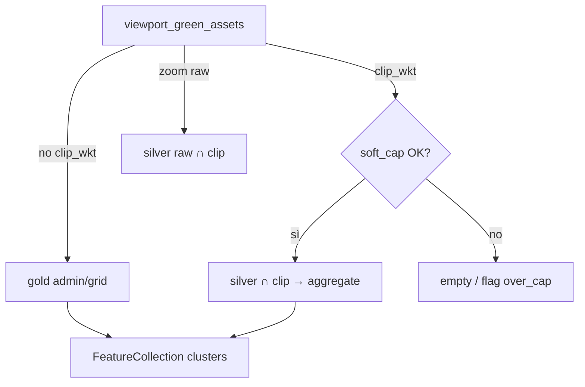

# Draw clip — cluster count esatti (soft cap)

**Data:** 2026-09-08  
**Stato:** accepted  
**Piano:** [2026-09-08-draw-clip-exact-cluster-counts-plan.md](./2026-09-08-draw-clip-exact-cluster-counts-plan.md)  
**Parent:** [2026-08-18-draw-on-map-spatial-clip-design.md](./2026-08-18-draw-on-map-spatial-clip-design.md)  
**Lakehouse:** [2026-09-04-green-lakehouse-only-pg-drop-design.md](./2026-09-04-green-lakehouse-only-pg-drop-design.md)

## Problema

Con `clip_wkt`, i cluster asset (admin + grid gold) vengono **filtrati per presenza** (centroide / extent ∩ clip) ma il `cluster_count` resta il totale **pre-aggregato** della cella/unità. I numeri risultano sfalzati rispetto al poligono disegnato.

Raw (zoom alto) e tabella sono già geometricamente corretti.

## Obiettivo

Quando c’è `clip_wkt`, i `cluster_count` devono contare solo gli asset che **intersecano il poligono** (stesso predicato di raw/tabella), senza degradare Area Italia (path gold invariato).

## Decisioni

| Tema | Scelta |
|------|--------|
| Path senza `clip_wkt` | Invariato: gold Parquet (admin/grid) |
| Path con `clip_wkt` | Aggregazione **live** da silver ∩ clip → cluster |
| Soft cap (opzione **A**) | Se il clip supera soglia → **non** aggregare; risposta controllata + UX “riduci area / zoom” |
| Stima proporzionale | **No** in V1 (scartata opzione C) |
| Sempre-esatto su clip enorme | **No** (scartata opzione B) |
| Contratto wire | Shape FeatureCollection invariata; proprietà opzionale `cluster_exact: true` / errore strutturato se over-cap |
| FE | Nessun cambio draw tool; toast/hint se over-cap |

## Approccio scelto (vs alternative)

1. **Live silver ∩ clip → grid/admin buckets** (scelto) — count esatti; costo proporzionale agli asset nel clip; soft cap protegge p95.
2. ~~Gold + stima area~~ — veloce ma fuorviante.
3. ~~Sempre live senza cap~~ — rischia multi-secondi (storico ~12s live grid nazionale su ~5.5M).

## Architettura

### Soft cap (soglie iniziali — calibrare in spike)

Valutare **prima** di scansionare silver (usa solo metadata / PostGIS admin + clip bounds):

| Metrica | Soglia proposta (spike conferma) |
|---------|----------------------------------|
| Comuni il cui extent interseca clip | ≤ **40** |
| Area clip (km², geodesica grezza) | ≤ **2 000** |
| Oppure stima asset da gold municipality ∩ clip | ≤ **200 000** |

Se una soglia è superata → **non** leggere silver per cluster; ritornare FeatureCollection vuota **oppure** feature sentinel / header log + codice proprietà `cluster_over_cap: true` (dettaglio in piano). Raw/tabella restano disponibili a zoom alto (già capped).

### Aggregazione esatta (sotto cap)

1. `resolve_prefixes` (date + hive) come oggi.
2. Interseca clip bounds con comuni (PostGIS `municipalities`) → lista `municipality_id` (prune).
3. DuckDB: `read_parquet` solo quelle partizioni; filtro `lon/lat` in clip.bounds; post-filter shapely `intersects(clip)` (stesso pattern di `read_assets_in_bbox`).
4. Bucket:
   - **Grid band** (zoom mid): cella mercator come `viewport_grid` / gold `grid_{z}`.
   - **Admin** (zoom basso): con clip forzare almeno livello `municipality` (già oggi); count = #asset nel comune ∩ clip (non totale gold).
5. Output `ViewportCluster` con `count` esatto, centroid = media punti nel bucket (o sample).

### Non in scope V1

- Ricalcolo gold all’ingest per poligoni arbitrari.
- FE cluster client-side.
- Cambi Area Italia / path senza clip.
- Exact count per `green_area_id` / sub-municipal senza clip (già path diverso).

## Performance attesa

| Caso | Target |
|------|--------|
| Area Italia | Invariato (gold) |
| Draw tipico (quartiere / comune) | p95 cluster **&lt; 500 ms** locale (spike misura) |
| Draw over-cap | Fail-fast **&lt; 100 ms** (solo stima soglia) |

Metriche: riuso `timed_op` / `lakehouse_op` con tag `clip_exact_cluster`.

## Rischi

| Rischio | Mitigazione |
|---------|-------------|
| Soft cap troppo basso → UX frustrante | Spike Lecce/Lazio; env `CLIP_EXACT_MAX_*` |
| Soft cap troppo alto → timeout | Hard timeout query + stesso over-cap |
| Divergenza count vs tabella | Stesso predicato intersects; test golden clip Lecce |
| Admin region/province con clip | Già forzati a municipality; exact = count per comune nel clip |

## Success criteria

- Draw + clip piccolo: somma `cluster_count` ≈ conteggio tabella (stesso clip/date), tolleranza 0.
- Draw over-cap: nessun count sbagliato; messaggio chiaro; nessuna regressione Area Italia.
- Nessun peggioramento p95 viewport senza `clip_wkt`.
