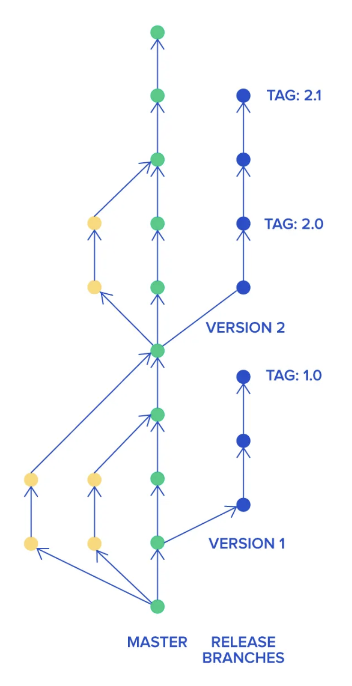

# Trunk Based Development (Fast Mode) – Linee Guida Operative



## 📌 Scopo

Questo repository adotta una strategia di **Trunk Based Development (TBD)** orientata alla massima velocità operativa.

Obiettivi:

- Integrare più volte al giorno
- Ridurre overhead di processo
- Eliminare colli di bottiglia (es. review formali)
- Mantenere `main` sempre funzionante

In questo progetto **non utilizziamo Merge Request obbligatorie**.

---

# 🌳 Struttura dei Branch

## Branch principale

- `main` è l’unico branch persistente.
- È la fonte di verità.
- Deve essere sempre in stato funzionante.

---

## Branch secondari

Consentiti solo branch a vita molto breve.

Regole:

- Durata massima: 24–48 ore
- Scope ridotto
- Eliminazione immediata dopo il merge

Esempio:

```bash
git checkout main
git pull origin main
git checkout -b fix/header-alignment
````

---

# 🔁 Workflow Standard (Senza Merge Request)

## 1. Allineamento obbligatorio

Prima di iniziare qualsiasi lavoro:

```bash
git checkout main
git pull origin main
```

---

## 2. Sviluppo locale

* Commit piccoli e atomici
* Log chiari
* Nessun accumulo di modifiche per giorni

Formato consigliato:

```
feat: add login validation
fix: correct mobile layout bug
refactor: simplify auth middleware
```

---

## 3. Rebase prima del push

Prima di integrare:

```bash
git checkout main
git pull --rebase origin main
```

Se si usa un branch:

```bash
git checkout feature/x
git rebase main
```

Obiettivo: evitare merge commit inutili.

---

## 4. Merge diretto su main

Una volta verificato localmente:

```bash
git checkout main
git merge feature/x
git push origin main
```

Oppure push diretto se consentito:

```bash
git push origin main
```

⚠ Responsabilità individuale: chi push-a garantisce che il codice non rompa `main`.

---

# 🚀 Continuous Integration

La CI rimane attiva ma non blocca il flusso con review formali.

Regole:

* Se la pipeline fallisce → si interrompe tutto e si fixa subito.
* Chi rompe `main` lo sistema immediatamente.
* Nessuna nuova feature finché `main` non torna verde.

`main` deve essere sempre:

* Compilabile
* Testabile
* Deployabile

---

# 🧩 Feature Incomplete

Per lavorare in velocità senza destabilizzare:

## Uso obbligatorio di Feature Flag

Esempio:

```ts
if (isFeatureEnabled("newCheckout")) {
  renderNewCheckout()
}
```

Regole:

* Mai lasciare codice parzialmente funzionante esposto.
* Le feature grandi devono essere spezzate.
* I flag vanno rimossi dopo il rollout.

---

# 📏 Regole Fondamentali

1. Integrare ogni giorno.
2. Nessun branch lungo.
3. Nessun accumulo di lavoro locale.
4. Nessun push senza aver testato.
5. Se rompi `main`, lo sistemi subito.
6. Modifiche grandi → spezzarle in parti piccole.
7. Refactoring continuo, non massivo.

---

# ❌ Cosa Evitare

* Branch di settimane
* “Finisco tutto e poi integro”
* Commit enormi
* Merge commit inutili
* Attendere giorni prima di pushare
* Code freeze per colpa di instabilità

---

# 🔥 Hotfix

Hotfix direttamente da `main`:

```bash
git checkout main
git pull origin main
# fix
git commit -m "fix: payment timeout issue"
git push origin main
```

Priorità assoluta al ripristino stabilità.

---

# 🧠 Cultura del Team

Questo modello funziona solo se:

* Il team è responsabile
* Il testing locale è serio
* L’integrazione è frequente
* La comunicazione è continua

Qui privilegiamo:

* Velocità
* Responsabilità individuale
* Integrazione continua reale

---

# 🎯 Obiettivo

* Rilasciare spesso
* Ridurre attrito operativo
* Eliminare burocrazia
* Tenere il codice sempre integrato

Questo repository opera in **Fast Trunk Mode**.
Chi contribuisce accetta queste regole.