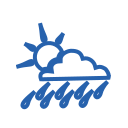
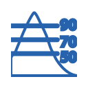
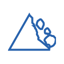

# Icone dxc-webkit (PNG)

Anteprima grafica di tutte le icone esportate da `dxc-webkit` (v1.6.0), colore primary `#2762AD`, 128×128 px.

| Icona | Nome |
|-------|------|
|  | `AccountBalanceIcon` |
|  | `AddCircleIcon` |
|  | `ArrowCircleDownIcon` |
|  | `ArrowCircleLeftIcon` |
|  | `ArrowCircleRightIcon` |
|  | `ArrowCircleUpIcon` |
|  | `ArrowDownCircleIcon` |
|  | `ArrowDownIcon` |
|  | `ArrowDownUpIcon` |
|  | `ArrowLeftIcon` |
|  | `ArrowRightIcon` |
|  | `ArrowSquareRightFillIcon` |
|  | `ArrowSquareRightIcon` |
|  | `ArrowUpIcon` |
|  | `AssistantIcon` |
|  | `CalendarBoldIcon` |
|  | `CalendarIcon` |
|  | `CallIcon` |
|  | `CaretDownFillIcon` |
|  | `CaretDownIcon` |
|  | `CaretUpFillIcon` |
|  | `CaretUpIcon` |
|  | `CategoryFillIcon` |
|  | `CategoryIcon` |
|  | `ChartIcon` |
|  | `ChatIcon` |
|  | `ClockIcon` |
|  | `CloseCircleIcon` |
|  | `CloseSquareIcon` |
|  | `CondizioniAtmosfericheIcon` |
|  | `CoperturaSuoloIcon` |
|  | `DangerIcon` |
|  | `DatabaseFillIcon` |
|  | `DatabaseIcon` |
|  | `DistribuzionePopolazioneIcon` |
|  | `DistribuzioneSpecieIcon` |
|  | `DocumentCopyIcon` |
|  | `DocumentDownloadBoldIcon` |
|  | `DocumentDownloadIcon` |
|  | `DocumentFilterFillIcon` |
|  | `DocumentFilterIcon` |
|  | `DocumentTextIcon` |
|  | `DocumentUploadIcon` |
|  | `DoorClosedIcon` |
|  | `DoorOpenIcon` |
|  | `DragHandleDotsIcon` |
|  | `EdificiIcon` |
|  | `EditIcon` |
|  | `ElementiMeteorologiciIcon` |
|  | `ElementiOceanograficiIcon` |
|  | `ElevazioneIcon` |
|  | `EllipsysIcon` |
|  | `EmojiSadIcon` |
|  | `EyeIcon` |
|  | `FacebookIcon` |
|  | `FirstlineIcon` |
|  | `FirstlineWhiteIcon` |
|  | `FolderAddIcon` |
|  | `FolderIcon` |
|  | `FolderMinusIcon` |
|  | `FolderSimpleIcon` |
|  | `GalleryIcon` |
|  | `GeologiaIcon` |
|  | `GlobalSearchIcon` |
|  | `GlobeAmericasIcon` |
|  | `Grid3x3Icon` |
|  | `GriglieGeograficheIcon` |
|  | `HabitatBiotipiIcon` |
|  | `HelpCircleIcon` |
|  | `HomeIcon` |
|  | `IdrografiaIcon` |
|  | `ImpiantiAgricoliAcquacolturaIcon` |
|  | `ImpiantiIndustrialiIcon` |
|  | `IndirizziIcon` |
|  | `InfoCircleIcon` |
|  | `InfoIcon` |
|  | `InformationIcon` |
|  | `InstagramIcon` |
|  | `LineArrowDownIcon` |
|  | `LineArrowUpIcon` |
|  | `LinkedinIcon` |
|  | `ListIcon` |
|  | `LoadingIcon` |
|  | `LogoRepubblicaItalianaIcon` |
|  | `LogoutIcon` |
|  | `MailIcon` |
|  | `MapBoldIcon` |
|  | `MapIcon` |
|  | `MaximizeIcon` |
|  | `MaximizeSingleFillIcon` |
|  | `MaximizeSingleIcon` |
|  | `MeteoGeografiaIcon` |
|  | `MinimizeSingleFillIcon` |
|  | `MinusCirlceIcon` |
|  | `MonitoraggioAmbientaleIcon` |
|  | `MoreSquareFillIcon` |
|  | `MoreSquareIcon` |
|  | `MountainBoldIcon` |
|  | `MountainIcon` |
|  | `NewTabIcon` |
|  | `NomiGeograficiIcon` |
|  | `NotificationIcon` |
|  | `OGCIcon` |
|  | `OrtoImmaginiIcon` |
|  | `ParcelleCatastaliIcon` |
|  | `PenFillIcon` |
|  | `PenIcon` |
|  | `PenToolIcon` |
|  | `PeopleIcon` |
|  | `PersonFillIcon` |
|  | `PinMapFillIcon` |
|  | `PlaceholderIcon` |
|  | `ProfileCircleIcon` |
|  | `ReceiptSearchIcon` |
|  | `RefreshIcon` |
|  | `RegioniBiogeograficheIcon` |
|  | `RegioniMarineIcon` |
|  | `RetiTrasportoIcon` |
|  | `RischioNaturaleIcon` |
|  | `RisorseEnergeticheIcon` |
|  | `RisorseMinerarieIcon` |
|  | `SaluteUmanaIcon` |
|  | `ScanningIcon` |
|  | `SearchIcon` |
|  | `SearchNormalIcon` |
|  | `SearchZoomInFillIcon` |
|  | `SearchZoomInIcon` |
|  | `SearchZoomOutFillIcon` |
|  | `SearchZoomOutIcon` |
|  | `SendSquareIcon` |
|  | `ServiziPubbliciIcon` |
|  | `SettingsFillIcon` |
|  | `SettingsIcon` |
|  | `ShareIcon` |
|  | `ShieldIcon` |
|  | `ShoppingCartIcon` |
|  | `SistemaRiferimentoIcon` |
|  | `SitiProtettiIcon` |
|  | `SlashIcon` |
|  | `StarFillIcon` |
|  | `StarIcon` |
|  | `StickerIcon` |
|  | `StickynoteBoldIcon` |
|  | `StickynoteIcon` |
|  | `SuoloIcon` |
|  | `TickCircleIcon` |
|  | `TimerIcon` |
|  | `TrashIcon` |
|  | `TreeBoldIcon` |
|  | `TreeIcon` |
|  | `TwitterIcon` |
|  | `UnitaAmministrativeIcon` |
|  | `UnitaStatisticheIcon` |
|  | `UserIcon` |
|  | `UtilizzoTerritorioIcon` |
|  | `VectorIcon` |
|  | `XIcon` |
|  | `YouTubeIcon` |
|  | `ZoneRegolamentateIcon` |
