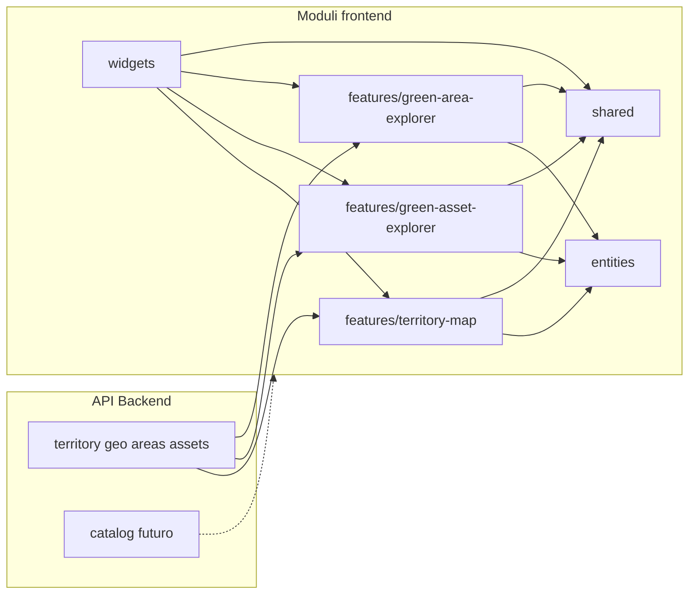
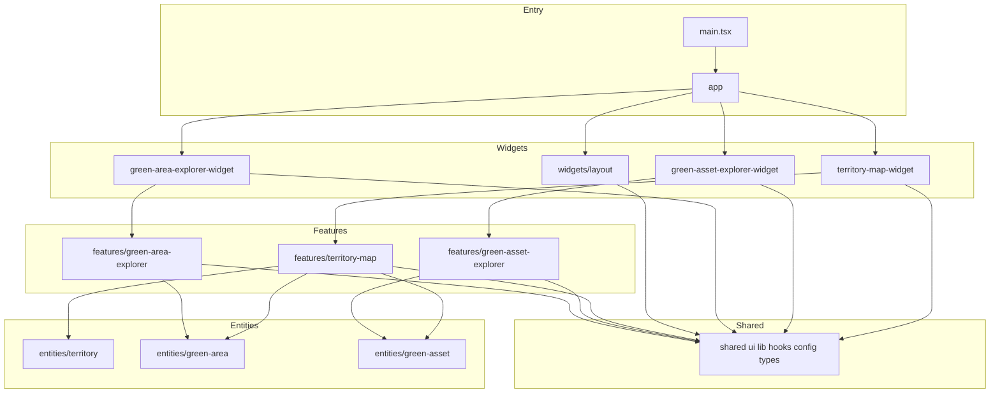
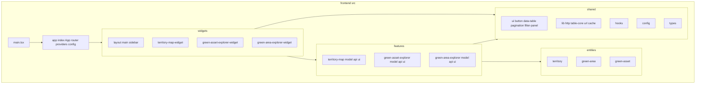

# Struttura modulare dei pacchetti – Frontend

Questo documento propone la **mappatura tra domini funzionali (e API backend) e moduli frontend**, con diagrammi Mermaid per dipendenze e struttura. Serve a mantenere confini chiari e a decidere dove mettere nuovo codice.

**Quando usarlo:** onboarding, scelta della cartella in cui aggiungere una feature, introduzione di una nuova feature o di un nuovo layer (es. catalog), verifica delle dipendenze tra moduli.

**Riferimento struttura cartelle:** [folders-structure-fe.md](./folders-structure-fe.md) – struttura dettagliata e convenzioni.

---

## Livello di maturità della struttura

| Aspetto | Situazione attuale | Cosa migliora la struttura |
|--------|---------------------|-----------------------------|
| **Confini e naming** | app, shared, entities, features (territory-map, green-asset-explorer, green-area-explorer), widgets | Esplicitare i **contract**: ogni feature/widget espone solo API pubblica (index.ts); tipi e dettagli interni restano nascosti |
| **Dipendenze** | app → widgets → features → entities → shared | Regole **scritte e verificabili** (es. lint sui path: features non importano da altre features; shared/entities non importano da app, features, widgets) |
| **Allineamento al backend** | API territory, green areas, green assets rispecchiano backend | Criteri di **evoluzione**: quando aggiungere una feature (es. catalog), quando introdurre un nuovo widget |
| **Separazione dei layer** | app, shared, entities, features, widgets | Chiarire **cosa vive dove**: chiamate HTTP in features/*/api o shared/lib/http; stato e orchestrazione in features/*/model; UI generica in shared/ui; dominio puro in entities |
| **Table e dati** | — | **Table Core Engine** headless in shared/lib/table-core; DataTable, FilterPanel, Pagination in shared/ui; feature explorer usano table-core + React Query |

---

## 1. Mappatura domini / API backend → Moduli frontend

| Dominio / API backend | Modulo frontend | Contenuto tipico |
|------------------------|-----------------|-------------------|
| **Gerarchia geo + aree + asset (mappa)** | **features/territory-map** + api interna | useTerritoryMap, useMapLayers, fetchers; territory.api, greenAreaMap.api, greenAssetMap.api; MapContainer, MapHeader, MapLayersToggle. |
| **Green assets (tabella, filtri, paginazione)** | **features/green-asset-explorer** + api interna | useGreenAssetTable (table-core), filters.config, columns.config, query; GreenAssetExplorer.api; GreenAssetTable, GreenAssetFilters, GreenAssetToolbar. |
| **Green areas (tabella, filtri, paginazione)** | **features/green-area-explorer** + api interna | useGreenAreaTable (table-core), filters.config, columns.config, query; GreenAreaExplorer.api; GreenAreaTable, GreenAreaFilters, GreenAreaToolbar. |
| **Dominio puro (tipi, schema, mapper)** | **entities/** (territory, green-area, green-asset) | types.ts, schema.ts, mapper.ts; nessuna chiamata API né UI. |
| **UI generica, utility, hook, config** | **shared/** | ui (button, input, data-table, pagination, filter-panel), lib (http, table-core, url, cache), hooks (useUrlState), config (map), types (api, geojson). |
| **Composizione schermate** | **widgets/** | layout (main, sidebar); territory-map-widget; green-asset-explorer-widget; green-area-explorer-widget. Solo orchestrazione di feature + layout. |
| **Bootstrap e routing** | **app/** | index.tsx (Providers + App), App.tsx (Router + vista default), router/, providers/, config/. |

---

## 2. Diagramma: Domini / API → Moduli frontend

*Le frecce indicano: "questo modulo frontend consuma questa API o questo modulo". Linea tratteggiata = previsto (catalog non ancora presente).*

---

## 3. Diagramma: Dipendenze tra moduli (regole)

Il grafo mostra chi può dipendere da chi (freccia = "A importa da B"). **Regola:** `app → widgets → features → entities → shared`. Mai invertire.

- **Consentito:** app → widgets; widgets → features, shared; features → entities, shared; entities e shared non importano da app, widgets, features.
- **Non consentito:** features → features; shared → features, entities, app, widgets; entities → app, features, widgets, shared (oltre a tipi puri se necessario).

---

## 4. Struttura ad albero (src layout)

*App e main sono il composition root; le frecce indicano "dipende da".*

---

## 5. Cosa vive in ogni layer

| Layer | Contenuto | Non deve contenere |
|-------|-----------|---------------------|
| **app/** | Bootstrap, Router, Providers, config (env, costanti). Monta widgets e vista default. | Logica di dominio, chiamate API, componenti di feature |
| **widgets/** | Composizione di feature + layout (TerritoryMapWidget, GreenAssetExplorerWidget, MainContent, Sidebar). | Logica di dominio, chiamate API dirette (usare le feature) |
| **features/** | Per use-case: model (hook, fetchers), api (fetcher, *.api.ts), ui (componenti). Usano table-core, DataTable, FilterPanel dove serve. | Import da altre features; logica fuori dal use-case |
| **entities/** | Tipi, schema, mapper di dominio puri (territory, green-area, green-asset). | Chiamate API, componenti, hook React, import da app/features/widgets |
| **shared/** | UI generica (button, data-table, pagination, filter-panel), lib (http, table-core, url, cache), hooks (useUrlState), config, types globali. | Import da features o entities; logica legata a un solo use-case |

---

## 6. Regole di dipendenza (da rispettare)

| Da → A | Consentito | Non consentito |
|--------|------------|------------------|
| **app/** | widgets, shared (se necessario) | features, entities (no import diretto; passare dai widgets) |
| **widgets/** | features, shared | Altre widgets (evitare); entities (preferire via feature) |
| **features/** | entities, shared | Altre features; app; widgets |
| **entities/** | — (solo tipi/utility puri) | app, features, widgets, shared (ecc. tipi condivisi) |
| **shared/** | — | app, features, widgets, entities |

Rendere queste regole **verificabili** (es. ESLint con restrizione sui path o strumenti tipo Nx/Barrel) migliora il rispetto della struttura nel tempo.

---

## 7. Table Core Engine e explorer

- **shared/lib/table-core:** motore headless (pagination, sorting, filtering, query-adapter per React Query). Le feature non implementano la logica tabella, passano solo queryKey, fetcher, colonne, schema filtri.
- **shared/ui:** DataTable, Pagination, FilterPanel sono generici; le feature (green-asset-explorer, green-area-explorer) li usano e forniscono config (columns, filters).
- **Sync URL:** useUrlState (shared/hooks) e queryParams (shared/lib/url) per deep-linking e persistenza filtri/paginazione.

---

## 8. Riepilogo e passi successivi

- **Allineamento con il backend:**  
  Le API in features (territory-map, green-asset-explorer, green-area-explorer) riflettono i contesti backend (geo, areas, assets). Un futuro modulo backend **catalog** può diventare una feature dedicata e un eventuale widget.

- **Struttura modulare:**  
  **app** (bootstrap, router, providers), **widgets** (composizione), **features** (un use-case per cartella: territory-map, green-asset-explorer, green-area-explorer), **entities** (dominio puro), **shared** (ui, lib, hooks, config, types). Dipendenze a senso unico: app → widgets → features → entities → shared.

- **Riferimenti:**  
  - [folders-structure-fe.md](./folders-structure-fe.md) – struttura dettagliata delle cartelle e convenzioni  
  - [modular-package-structure.md](../../../backend/docs/modular-package-structure.md) – struttura modulare backend (per allineare api e domini)
