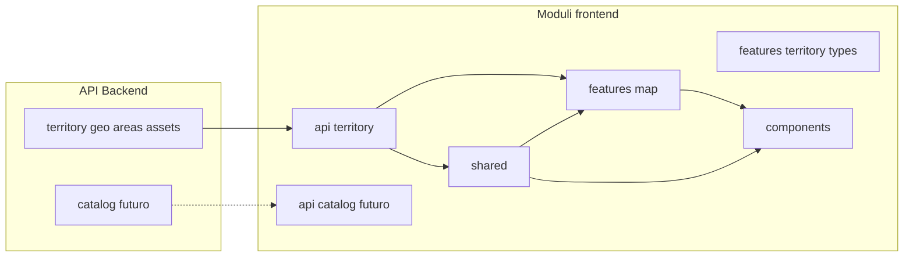
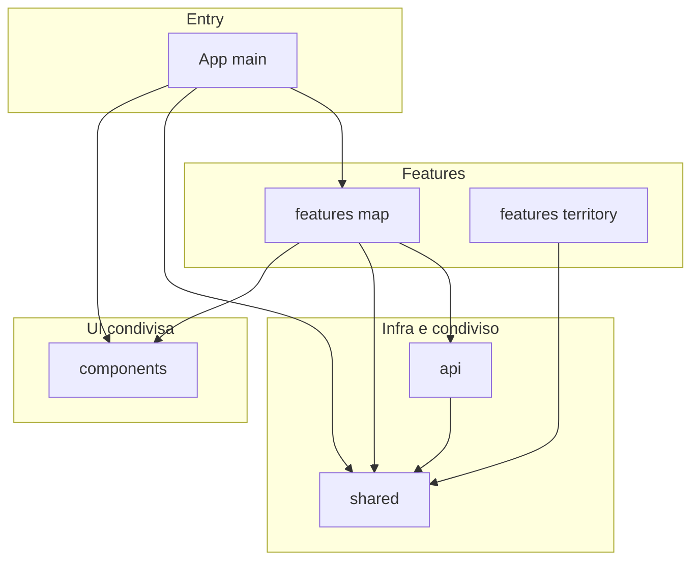
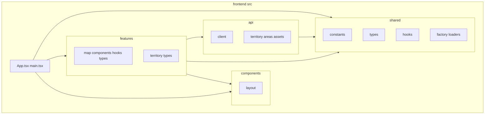

# Struttura modulare dei pacchetti – Frontend

Questo documento propone la **mappatura tra domini funzionali (e API backend) e moduli frontend**, con diagrammi Mermaid per dipendenze e struttura. Serve a mantenere confini chiari e a decidere dove mettere nuovo codice.

**Quando usarlo:** onboarding, scelta della cartella in cui aggiungere una feature, introduzione di una nuova feature o di un nuovo layer (es. catalog), verifica delle dipendenze tra moduli.

---

## Livello di maturità della struttura

| Aspetto | Situazione attuale | Cosa migliora la struttura |
|--------|---------------------|-----------------------------|
| **Confini e naming** | api/territory, shared, features/map (e territory/types), components | Esplicitare i **contract**: cosa espone ogni feature (solo componenti e hook pubblici), cosa non deve uscire (tipi interni, dettagli API) |
| **Dipendenze** | api usa shared; App usa shared/hooks, features, components | Regole **scritte e verificabili** (es. lint sui path: features non importano da altre features; shared non importa da features) |
| **Allineamento al backend** | api/territory con areas e assets rispecchia backend | Criteri di **evoluzione**: quando aggiungere una feature (es. catalog), quando splittare una feature (es. map vs navigazione) |
| **Separazione dei layer** | api, shared, features, components già separati | Chiarire **cosa vive dove**: chiamate HTTP solo in api; stato UI e logica di feature in features; UI riutilizzabile in components; niente logica di dominio in components |
| **Trade-off e alternative** | Scelte implicite (un’unica feature map, hook territorio in shared) | **Rationale** documentato: perché gli hook territorio sono in shared; perché map e territory types sono organizzati così; cosa si è scartato |

Sarebbe utile adottare **ADR (Architecture Decision Records)**: documenti brevi (uno per decisione) che registrano il contesto, la decisione presa e le conseguenze. Servono a non perdere il perché di una scelta quando il team cambia, a far discutere le alternative in modo esplicito e a dare a chi arriva dopo il rationale delle scelte—ad esempio perché gli hook di navigazione territorio stanno in `shared` invece che in `features/territory`, o perché si è scelto un unico layer `api/territory` invece di un modulo per ogni dominio backend.

---

## 1. Mappatura domini / API backend → Moduli frontend

| Dominio / API backend | Modulo frontend | Contenuto tipico |
|------------------------|-----------------|-------------------|
| **Gerarchia geo + aree + asset** (territory) | **api/territory** | Client: `territory.ts`, `areas/greenAreas.api.ts`, `assets/greenAssets.api.ts`. Contratti (tipi risposta) e fetcher. |
| **Catalogo DBT** (futuro) | **api/catalog** (futuro) | Endpoint tipi/codici; stesso pattern di api/territory. |
| **Costanti, tipi globali, hook condivisi** | **shared** | `constants/`, `types/`, `styles/`, `hooks/` (es. useTerritoryMap, useTerritoryNavigation), `factory/loaders`. Niente logica di business legata a una sola schermata. |
| **Mappa e navigazione territorio** | **features/map** (e tipi in **features/territory**) | Componenti mappa (MapHeader, palette verde), tipi mappa e territorio, config layer (cluster, loaders). |
| **Layout e UI riutilizzabile** | **components** | Layout (sidebar, main-content, breadcrumb), componenti UI generici. Nessuna chiamata API né stato di dominio. |
| **Composizione e bootstrap** | **App.tsx / main.tsx** | Montaggio hook shared, feature map e layout; nessuna logica di dominio oltre al wiring. |

---

## 2. Diagramma: Domini / API → Moduli frontend

*Le frecce indicano: “questo modulo frontend consuma questa API o questo modulo”. Linea tratteggiata = previsto (catalog non ancora presente).*

---

## 3. Diagramma: Dipendenze tra moduli (regole)

Il grafo mostra chi può dipendere da chi (freccia = “A importa da B”). **shared** e **api** sono usati da app e features; le **features** non si importano tra loro; **components** sono usati da app e features.

- **Consentito:** App → features, shared, components; features → api, shared, components; api → shared.
- **Non consentito:** features → features; shared → features o api; components → features, api o shared (oltre a tipi/shared minimi).

---

## 4. Struttura ad albero (src layout)

*App e main sono il composition root; le frecce indicano “dipende da”.*

---

## 5. Cosa vive in ogni layer

| Layer | Contenuto | Non deve contenere |
|-------|-----------|---------------------|
| **api/** | Fetcher, URL, tipi di richiesta/risposta, adattatori da JSON a tipi di dominio (se necessario) | Stato React, hook, componenti, logica UI |
| **shared/** | Costanti, tipi globali, hook riutilizzabili da più feature, utility, loaders/factory condivisi, stili globali | Import da features; logica legata a una sola schermata |
| **features/** | Componenti, hook e tipi specifici della feature; eventuale stato locale; uso di api e shared | Import da altre features; chiamate HTTP dirette (usare api) |
| **components/** | Componenti UI e layout riutilizzabili, presentazionali o layout puri | Chiamate API, stato di dominio, import da features (solo tipi condivisi da shared se necessario) |
| **App / main** | Composizione: quale hook, quale feature, quale layout | Logica di dominio complessa (delegare a features o shared) |

---

## 6. Regole di dipendenza (da rispettare)

| Da → A | Consentito | Non consentito |
|--------|------------|----------------|
| **features/** | api, shared, components | Altre features (no feature A → feature B) |
| **api/** | shared (costanti, tipi) | features, components |
| **shared/** | — | features, api (solo tipi/utility generici) |
| **components/** | shared (tipi, costanti, stili) | features, api |
| **App** | shared, features, components | — |

Rendere queste regole **verificabili** (es. ESLint con restrizione sui path o strumenti tipo Nx/Barrel) migliora il rispetto della struttura nel tempo.

---

## 7. Riepilogo e passi successivi

- **Allineamento con il backend:**  
  `api/territory` riflette i contesti backend (geo, areas, assets). Un futuro modulo backend **catalog** può diventare `api/catalog` e essere usato da feature che gestiscono tipi/codici DBT.

- **Struttura modulare:**  
  **api** (chiamate e contratti), **shared** (tutto ciò che è usato da più feature o dall’app), **features** (una cartella per area funzionale: map, e tipi territorio dove servono), **components** (layout e UI condivisa). Nessuna dipendenza tra feature; dipendenze a senso unico verso api e shared.

- **Riferimenti:**  
  - [folders-structure-fe.md](./folders-structure-fe.md) – struttura dettagliata delle cartelle e convenzioni  
  - [modular-package-structure.md](../../backend/docs/modular-package-structure.md) – struttura modulare backend (per allineare api e domini)
